# Stablecoin Program — RFP-013 design

**RFP:** [RFP-013 Reflexive Stablecoin Protocol](https://github.com/logos-co/rfp/blob/master/RFPs/RFP-013-reflexive-stablecoin-protocol.md)
**Date:** 2026-06-03
**Status:** Draft — design under review

## Table of contents

1. [Overview](#1-overview)
2. [Architectural decisions](#2-architectural-decisions)
3. [Account topology](#3-account-topology)
    - [How it all works](#how-it-all-works)
    - [3.1 Program-owned global singletons](#31-program-owned-global-singletons-created-by-initialize_program)
    - [3.2 Per-position accounts](#32-per-position-accounts-one-set-per-open-position)
    - [3.3 External accounts](#33-external-accounts-read-only-bound-or-configured)
4. [Data structures](#4-data-structures)
    - [4.1 `ProtocolParameters`](#41-protocolparameters)
    - [4.2 `StabilityFeeAccumulator`](#42-stabilityfeeaccumulator)
    - [4.3 `RedemptionPriceState`](#43-redemptionpricestate)
    - [4.4 `Position`](#44-position)
    - [4.5 External account shapes](#45-external-account-shapes-read-only-reused)
5. [Constants and conventions](#5-constants-and-conventions)
    - [5.1 Fixed point](#51-fixed-point)
    - [5.2 `compound_rate`](#52-compound_rate)
    - [5.3 Current value projections](#53-current-value-projections-read-on-the-hot-path)
6. [Math](#6-math)
    - [6.1 Nominal debt](#61-nominal-debt)
    - [6.2 Collateralization invariant](#62-collateralization-invariant)
    - [6.3 Normalized-debt deltas with directional rounding](#63-normalized-debt-deltas-with-directional-rounding)
    - [6.4 PI controller](#64-pi-controller-update_redemption_rate)
    - [6.5 Debt-accrual terminology](#65-debt-accrual-terminology-quick-reference)
7. [Cross-instruction invariants](#7-cross-instruction-invariants)
8. [Bound choices](#8-bound-choices)
9. [Instruction set](#9-instruction-set)
    - [9.1 Bootstrap](#91-bootstrap)
    - [9.2 Permissionless pokes](#92-permissionless-pokes)
    - [9.3 Position lifecycle](#93-position-lifecycle)
    - [9.4 Admin parameter updates](#94-admin-parameter-updates)
    - [9.5 Emergency](#95-emergency)
10. [Per-instruction details](#10-per-instruction-details)
    - [10.1 `initialize_program`](#101-initialize_program)
    - [10.2 `accrue_stability_fee`](#102-accrue_stability_fee)
    - [10.3 `update_redemption_rate`](#103-update_redemption_rate)
    - [10.4 `open_position`](#104-open_position)
    - [10.5 `deposit_collateral`](#105-deposit_collateral)
    - [10.6 `withdraw_collateral`](#106-withdraw_collateral)
    - [10.7 `generate_debt`](#107-generate_debt)
    - [10.8 `repay_debt`](#108-repay_debt)
    - [10.9 `close_position`](#109-close_position)
    - [10.10–10.16 Admin parameter updates](#1010-1016-admin-parameter-updates)
    - [10.17–10.18 `freeze` / `unfreeze`](#1017-1018-freeze--unfreeze)
11. [Edge cases](#11-edge-cases)
12. [Out of scope](#12-out-of-scope-per-rfp)
13. [Forward integration](#13-forward-integration)
14. [Open follow-ups](#14-open-follow-ups-not-blocking-this-design)
15. [Implementation plan handoff](#15-implementation-plan-handoff)
16. [Sample scenarios](#16-sample-scenarios)
    - [16.1 Alice's full lifecycle](#161-alices-full-lifecycle)
    - [16.2 Emergency freeze](#162-emergency-freeze)
    - [16.3 Redemption price & controller walkthrough](#163-redemption-price--controller-walkthrough)

---

## 1. Overview

RFP-013 asks for a non-pegged, reflexive stablecoin on LEZ modelled on RAI / Reflexer. The protocol mints stablecoin against collateralized debt positions ("SAFEs" in RAI's vocabulary), tracks debt via a normalized-debt + accumulator pattern so a single global update applies interest to every position without per-position writes, and continuously drifts a redemption price via a PI feedback controller fed by the deviation between the stablecoin's market price and the protocol's redemption price.

This document is the design for the **on-chain program**. The CLI, mini-app, and SDK (RFP-013's other deliverables) get their own specs once this is locked.

## 2. Architectural decisions

| Decision | Choice | Rationale |
|---|---|---|
| Spec scope | Full on-chain program end-state | Every instruction, account type, controller math, oracle interface, admin/freeze hooks. CLI/mini-app/SDK get separate specs. |
| Instance model | Single deployment = one stablecoin + one collateral | Matches RFP's RAI framing and singular phrasing. Adding a second collateral means deploying the program again as a separate instance with its own distinct stablecoin. |
| Stablecoin ownership | Program-owned PDA, created by `initialize_program` | Mint/Burn chained calls authorize via the stablecoin program PDA seed. Single source of truth. |
| Position addressing | PDA seed = `(owner_account_id, position_nonce)` | Multiple positions per owner. Matches RAI / DAI / Liquity. |
| Price model | Single oracle quoting stablecoin in collateral units; redemption price in collateral-per-stablecoin | One oracle read on the hot path. Closed-loop unit system; no external reference asset. Single point of failure mitigated by staleness gate + freeze authority. |
| Fee accrual | Pure RAI virtual accrual — no surplus mint | Fees grow only as `accumulated_rate` multiplier. Nominal debt eventually exceeds supply; users acquire stablecoin from market to repay (the controller drives that demand). |
| Rate plumbing | Lazy globals + permissionless pokes | Position ops read but don't write globals → no contention. Concurrent permissionless `accrue_stability_fee` and `update_redemption_rate` don't conflict. |
| Authority model | Inline `admin_account_id` and `freeze_authority_account_id` in `ProtocolParameters` | Adapts trivially to RFP-001 / RFP-002 when they land. |
| Lifecycle granularity | Granular per-op + `close_position` | Six position-facing instructions, each with a single state transition. |
| Oracle producer | Decoupled — struct only (`OraclePriceAccount`), not program | Producer is configurable via `set_market_price_oracle`; we don't pin `program_owner`. Multi-oracle redundancy (RFP soft requirement) achievable later by pointing at an aggregator that itself produces an `OraclePriceAccount`. |

## 3. Account topology

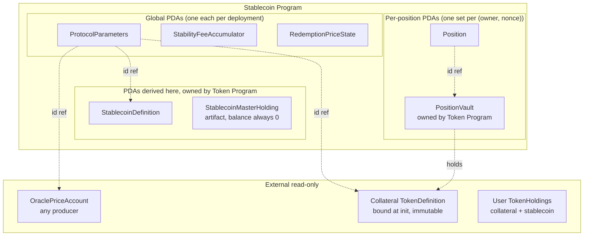

### How it all works

A walkthrough of who calls what and what changes when. Detailed mechanics are in §10; this is the overall flow.

**Day 0 — setup.** The deployer publishes the program binary, then calls `initialize_program` (§10.1). That one call creates all five program-owned accounts: the stablecoin `TokenDefinition` (via a chained `Token::NewFungibleDefinition`), its required paired master holding (empty), the `ProtocolParameters` account, and the two state-tracking accounts (`StabilityFeeAccumulator` and `RedemptionPriceState`). The same call sets which collateral and oracle the protocol uses, picks the admin and freeze-authority accounts, and stores the initial fee rate, controller gains, safety ratio, and timing parameters. Once it returns, the protocol exists and users can start interacting.

**Running the protocol — keepers advance the globals.** Two instructions any account can call keep the protocol's globals current:

- `accrue_stability_fee` (§10.2) advances the global fee multiplier. Nothing moves; the multiplier grows so every open position accrues interest at once.
- `update_redemption_rate` (§10.3) reads the market-price oracle, runs the PI controller (§6.4), and updates the redemption price and its drift rate. The redemption price then keeps drifting toward the market price until the next call.

These two are usually run by keeper bots that batch them into one transaction. They cost gas but earn no reward — anyone with money in the protocol wants the globals fresh before they act.

**A user opens a position and borrows.** A user picks a `position_nonce` (any integer — 0, 7, whatever) and calls `open_position` (§10.4) with some collateral. Two accounts get created: their `Position` (at `hash(owner, nonce)`, owned by the stablecoin program, starting with zero debt) and a `PositionVault` (at `hash(position)`, owned by the Token Program) that holds the collateral tokens. They can then call `generate_debt` (§10.7) to mint stablecoin into their own holding. The mint increases the position's normalized debt; the collateralization check prevents over-borrowing; the call fails if the oracle is stale or the protocol is frozen.

**Time passes; debt grows; users adjust.** As keepers advance the fee multiplier, every position's debt grows even though no per-position write happens (the RAI accumulator approach, §6.1). Users can:

- `deposit_collateral` (§10.5) to add more collateral and improve the ratio.
- `withdraw_collateral` (§10.6) to take some back — only allowed if the position still meets the safety ratio afterwards.
- `repay_debt` (§10.8) to burn stablecoin and lower the debt. To pay off accrued interest, users may need to buy extra stablecoin on the market.

**Closing out.** When a position's debt and collateral are both zero, `close_position` (§10.9) clears the `Position` account. This does **not** free the nonce for reuse: the vault PDA at `hash(position_id)` lingers (the Token Program has no `CloseHolding`), so reopening at the same `(owner, nonce)` always fails `open_position`'s vault-uninitialized check — the user must pick a fresh nonce. See §11 and §14.

**Admin tunes parameters.** The admin can change the stability fee (which auto-applies any pending interest first so the new rate doesn't apply retroactively), tighten or loosen the collateralization ratio, change the controller gains, point at a different oracle, adjust the timing intervals, or rotate the admin / freeze-authority handles. None of these touch any position directly. The admin CANNOT touch a position, mint or burn stablecoin, reset the redemption price, or change the stablecoin / collateral definitions — those are fixed at setup.

**Emergency.** If something goes wrong (a broken oracle, an exploit in progress), the freeze authority calls `freeze` (§10.17). That sets `is_frozen = true` in `ProtocolParameters`. After that, operations that increase risk (`open_position`, `generate_debt`, `withdraw_collateral`) fail; operations that reduce risk (`deposit_collateral`, `repay_debt`, `close_position`), keeper updates, and admin changes still work so users can pay down debt and operators can fix the problem. The admin may point at a clean oracle via `set_market_price_oracle`, and the freeze authority calls `unfreeze` to resume normal operation.

### 3.1 Program-owned global singletons (created by `initialize_program`)

Five single-instance accounts hold all the globally-shared state. Each is a PDA derived from the stablecoin program id and a constant seed string, so addresses are deterministic per deployment.

**`ProtocolParameters`** — PDA seed `"PROTOCOL_PARAMETERS"`, owned by the stablecoin program.

*Holds:* admin handle, freeze-authority handle, stability fee, controller gains, minimum collateralization ratio, polling-interval parameters, frozen flag, oracle id, and the bound stablecoin / collateral definition ids.

*Why:* single source of truth for protocol configuration. Kept separate from the dynamic state (`StabilityFeeAccumulator`, `RedemptionPriceState`) so that admin parameter changes don't contend with permissionless pokes — different writers touch different accounts.

**`StabilityFeeAccumulator`** — PDA seed `"STABILITY_FEE_ACCUMULATOR"`, owned by the stablecoin program.

*Holds:* the compounded stability-fee rate at the last accrual, plus the wall-clock timestamp of that accrual.

*Why:* implements the RAI accumulator trick (§6.1) — instead of writing interest into every position on every accrual, we maintain one global multiplier. Each position's nominal debt is then `normalized_debt × accumulator`, computed lazily at read time. Read by every debt-touching op; written only by `accrue_stability_fee` and the auto-accrue path in `set_stability_fee_per_second`.

**`RedemptionPriceState`** — PDA seed `"REDEMPTION_PRICE_STATE"`, owned by the stablecoin program.

*Holds:* the redemption price anchor (at the last update), the per-second drift rate, the PI controller's persisted integral term, and the wall-clock timestamp of the last update.

*Why:* the redemption price is the protocol's target value (in collateral-per-stablecoin); the controller continuously drifts it based on the deviation between market price and target. Storing as `(anchor, rate, last_updated_at)` lets the current value be projected on the fly without writing every block — only `update_redemption_rate` re-anchors it.

**`StablecoinDefinition`** — PDA seed `"STABLECOIN_DEFINITION"`, owned by the **Token Program** (PDA-derived under the stablecoin program).

*Holds:* the stablecoin's `TokenDefinition::Fungible` — name, current `total_supply`, no metadata.

*Why:* the stablecoin is a normal fungible token on LEZ — it composes with wallets, AMMs, ATAs, anything else that understands the Token Program. Putting the definition at a stablecoin-program-derived PDA means the **stablecoin program's PDA seed authorizes every chained `Token::Mint` / `Token::Burn`** issued from `generate_debt` / `repay_debt`. No off-band coordination needed; the program is structurally the only mintable authority.

**`StablecoinMasterHolding`** — PDA seed `"STABLECOIN_MASTER_HOLDING"`, owned by the **Token Program** (PDA-derived under the stablecoin program).

*Holds:* a `TokenHolding::Fungible` for the stablecoin with `balance = 0` permanently.

*Why this exists at all:* a Token-Program-API artifact. `Token::NewFungibleDefinition` always creates a definition AND a paired holding in the same call, and mints `total_supply` units into that holding. There's no variant that creates a definition alone. We pass `total_supply = 0` — our stablecoin starts with **zero** supply because every coin in existence must come from a user calling `generate_debt` against real collateral (a non-zero initial supply would be free, unbacked money). The master holding is therefore born empty and never touched again. Modeling it as a deterministic stablecoin-program PDA contains the artifact at a known, addressable location instead of leaking it into someone's user account.

A future Token Program extension (`Token::NewFungibleDefinitionWithoutHolding`, tracked in §14 follow-ups) would let `initialize_program` drop this account entirely.

**Why split the globals?** Each one has exactly one writer family:

- `ProtocolParameters` ← `initialize_program`, admin `set_*`, `freeze` / `unfreeze`.
- `StabilityFeeAccumulator` ← `initialize_program`, `accrue_stability_fee`, `set_stability_fee_per_second` (auto-accrues inline).
- `RedemptionPriceState` ← `initialize_program`, `update_redemption_rate`.
- `StablecoinDefinition` + `StablecoinMasterHolding` ← `initialize_program` via chained `Token::NewFungibleDefinition`; afterwards the definition's `total_supply` is incremented / decremented by `Token::Mint` / `Token::Burn` from `generate_debt` / `repay_debt`. The master holding is never touched again.

That strict writer separation means a keeper calling `accrue_stability_fee`, another keeper calling `update_redemption_rate`, and a user calling `withdraw_collateral` in the same block don't contend on any account.

### 3.2 Per-position accounts (one set per open position)

Created on demand by `open_position` and cleared by `close_position`. Both accounts' addresses are deterministic from the owner and a nonce, so clients can discover positions without an off-chain index.

**`Position`** — PDA seed `hash(owner_account_id, position_nonce)`, owned by the stablecoin program.

*Holds:* owner id, position nonce, the vault PDA address, current collateral amount, normalized debt amount, and the opened-at timestamp.

*Why:* the canonical state for one CDP. Owner authorization is checked against `owner_account_id` on every op. Storing the vault id explicitly is redundant (it's derivable) but saves the derivation cost on every read. The whole struct is owned by the stablecoin program — that's how we restrict who can write to it (only this program's instructions).

**`PositionVault`** — PDA seed `hash(position_id)`, owned by the **Token Program** (PDA-derived under the stablecoin program).

*Holds:* a `TokenHolding::Fungible` for the collateral token, with `balance` mirroring `Position.collateral_amount` after every op.

*Why:* the actual custody account for the collateral. Each open position has its own vault so that `Token::Transfer`s in (deposit / open) and out (withdraw / future liquidation) target a single isolated holding. PDA-derived under the stablecoin program means we authorize transfers OUT of the vault via the vault's PDA seed in chained `Token::Transfer` calls — no per-position private key, the program's derivation IS the authorization.

### 3.3 External accounts (read-only, bound or configured)

These already exist on chain before any stablecoin interaction; the program just references them.

**`OraclePriceAccount`** (market price) — referenced via `ProtocolParameters.market_price_oracle_id`. Owned by whichever oracle program produced it (typically `twap_oracle`, but any producer that emits this struct shape is acceptable).

*Holds:* the standard `OraclePriceAccount` shape from `twap_oracle_core` — base/quote asset ids, the price, an observation timestamp, source id, and confidence interval.

*Why:* the protocol's only source of market-side truth — what is one stablecoin actually worth in collateral, right now. Read by `update_redemption_rate` (the controller's feedback signal) and as a staleness gate on `generate_debt` (RFP R3). The producer is rotated by the admin via `set_market_price_oracle`; we don't pin its `program_owner`, so future multi-oracle aggregators slot in unchanged.

**Collateral `TokenDefinition`** — referenced via `ProtocolParameters.collateral_definition_id` (set at init, IMMUTABLE). Owned by the Token Program.

*Holds:* the collateral asset's `TokenDefinition::Fungible` (name, total supply).

*Why:* defines the only collateral the protocol accepts. Read by `open_position` (to set up the vault as a holding for this definition) and by every op that validates a user's collateral holding's `definition_id`. Bound at init because changing it would orphan every existing vault (still custodying the old collateral) while users believed positions were backed by the new one — instead, deploy a fresh program instance with a different collateral.

**User `TokenHolding`s** — passed per call by the caller. Owned by the Token Program.

*Holds:* `TokenHolding::Fungible` either of the collateral (used as source for `open_position` / `deposit_collateral`, destination for `withdraw_collateral`) or of the stablecoin (destination for `generate_debt`, source for `repay_debt`).

*Why:* the user's actual money. The program never owns or moves these directly — it always goes through chained `Token::Transfer`/`Mint`/`Burn`, authorized by the user's signature on the outer transaction (for source holdings) or by a stablecoin-program PDA seed (for vault sources / definition mints).

## 4. Data structures

Constants and conventions appear first (§ 5); these types reference them.

### 4.1 `ProtocolParameters`

```rust
#[account_type]
pub struct ProtocolParameters {
    /// Authority required for every parameter-update and admin-rotation instruction.
    pub admin_account_id: AccountId,
    /// Authority required for `freeze` / `unfreeze`.
    pub freeze_authority_account_id: AccountId,
    /// The stablecoin's `TokenDefinition` PDA. Set at init; IMMUTABLE — changing it would
    /// break supply accounting against the existing on-chain stablecoin float.
    pub stablecoin_definition_id: AccountId,
    /// The single accepted collateral's `TokenDefinition`. Bound at init; IMMUTABLE —
    /// changing it would orphan every position vault.
    pub collateral_definition_id: AccountId,
    /// `OraclePriceAccount` producing stablecoin-in-collateral market price.
    /// Updatable by admin via `set_market_price_oracle` (oracle rotation).
    pub market_price_oracle_id: AccountId,
    /// Per-second multiplicative stability fee. Stored as `(1 + r_per_second) * FIXED_POINT_ONE`.
    /// Updatable by admin via `set_stability_fee_per_second` (auto-accrues first).
    pub stability_fee_per_second: u128,
    /// PI controller Kp. Signed.
    pub controller_proportional_gain: i128,
    /// PI controller Ki. Signed.
    pub controller_integral_gain: i128,
    /// Minimum collateralization ratio in fixed-point. e.g. `1.5 * FIXED_POINT_ONE` = 150%.
    pub minimum_collateralization_ratio: u128,
    /// Min seconds between successful `accrue_stability_fee` calls (spam guard).
    pub minimum_seconds_between_fee_accruals: u64,
    /// Min seconds between successful `update_redemption_rate` calls (RFP F2).
    pub minimum_seconds_between_rate_updates: u64,
    /// Reject oracle observations older than this (RFP R3 staleness gate).
    pub maximum_oracle_price_age_seconds: u64,
    /// `true` blocks `open_position`, `generate_debt`, `withdraw_collateral`.
    /// `deposit_collateral` / `repay_debt` / `close_position` / pokes / admin / freeze ops
    /// remain available so users can deleverage out and operators can re-tune.
    pub is_frozen: bool,
}
```

### 4.2 `StabilityFeeAccumulator`

```rust
#[account_type]
pub struct StabilityFeeAccumulator {
    /// Accumulator at `last_accrued_at`. Initialized to `FIXED_POINT_ONE`.
    /// Updated on accrual via `anchor * compound_rate(stability_fee_per_second, Δt)`.
    pub accumulated_rate_at_last_accrual: u128,
    /// Unix seconds of the last accrue. Current accumulator on the read side =
    /// `anchor * compound_rate(rate, now - last_accrued_at) / FIXED_POINT_ONE`.
    pub last_accrued_at: u64,
}
```

### 4.3 `RedemptionPriceState`

```rust
#[account_type]
pub struct RedemptionPriceState {
    /// Redemption price at `last_updated_at`, in collateral per stablecoin, fixed-point.
    pub redemption_price_at_last_update: u128,
    /// Per-second drift multiplier, stored as `(1 + r) * FIXED_POINT_ONE`.
    /// Below `FIXED_POINT_ONE` = decay. Output of the PI controller.
    pub redemption_rate_per_second: u128,
    /// Persisted integral state of the PI controller. Clamped on every update for
    /// anti-windup (§ 6.4).
    pub controller_integral_term: i128,
    /// Unix seconds of the last update. Read-side current price =
    /// `anchor * compound_rate(rate, now - last_updated_at) / FIXED_POINT_ONE`.
    pub last_updated_at: u64,
}
```

### 4.4 `Position`

```rust
#[account_type]
pub struct Position {
    /// Owner of the position. Required to be `is_authorized` for every position op.
    /// Also stored for client discovery (PDA seed isn't reversible).
    pub owner_account_id: AccountId,
    /// User-chosen on `open_position`. Together with owner forms the PDA seed.
    pub position_nonce: u64,
    /// Collateral vault PDA. Stored explicitly for op-time efficiency.
    pub vault_account_id: AccountId,
    /// Collateral atomic units. INVARIANT: equals `vault_holding.balance` after every op.
    pub collateral_amount: u128,
    /// Stablecoin atomic units divided by the accumulator at mint time.
    /// **Nominal debt at time T** = `normalized_debt_amount * accumulated_rate(T) / FIXED_POINT_ONE`.
    /// Storing normalized lets one global accumulator update apply interest to every position.
    pub normalized_debt_amount: u128,
    /// Unix seconds when the position was first opened. UX/analytics; not used in protocol logic.
    pub opened_at: u64,
}
```

### 4.5 External account shapes (read-only, reused)

- `OraclePriceAccount` from `twap_oracle_core` — required at oracle reads: `base_asset = stablecoin_definition_id`, `quote_asset = collateral_definition_id`, `price > 0`, `now − timestamp ≤ maximum_oracle_price_age_seconds`.
- `TokenDefinition::Fungible` from `token_core` — stablecoin (PDA-derived under us; owned by Token Program) and collateral (externally created).
- `TokenHolding::Fungible` from `token_core` — vault and user holdings.

## 5. Constants and conventions

### 5.1 Fixed point

```rust
/// The value 1.0 in our 27-decimal fixed-point representation.
/// Every rate, ratio, and price-multiplier field stores `actual_value * FIXED_POINT_ONE`.
pub const FIXED_POINT_ONE: u128 = 10u128.pow(27);
```

The 27-decimal choice matches MakerDAO / RAI's `RAY` precision and gives enough headroom for rate compounding over years without underflow.

- All multiplications of fixed-point values use `u256` (`i256` for signed) intermediates to avoid overflow; results are reduced back to `u128` / `i128` after dividing by `FIXED_POINT_ONE`.
- Rounding direction is chosen per use site to favour the protocol (§ 6.3).

### 5.2 `compound_rate`

```rust
/// Returns `per_second_rate ^ seconds_elapsed` in fixed point (where `1.0 == FIXED_POINT_ONE`).
///
/// O(log seconds_elapsed) — exponentiation by squaring. Uses u256 intermediates.
/// Same algorithm as MakerDAO / RAI's `rpow`.
pub fn compound_rate(per_second_rate: u128, seconds_elapsed: u64) -> u128;
```

Edge cases:

- `seconds_elapsed = 0` → returns `FIXED_POINT_ONE` (identity element).
- `per_second_rate = FIXED_POINT_ONE` → returns `FIXED_POINT_ONE` regardless of `seconds_elapsed`.
- `per_second_rate < FIXED_POINT_ONE` → result < `FIXED_POINT_ONE` (compounding decay).
- Overflow guard: callers clamp the elapsed window to `MAXIMUM_COMPOUNDING_WINDOW_SECONDS` before calling (§5.3). This is load-bearing, not decorative: over an *unbounded* window, any `per_second_rate > FIXED_POINT_ONE` eventually overflows `rate ^ seconds_elapsed` regardless of how close to `1.0` it is — the §8 rate bound alone does **not** prevent it.

**In plain English:** this is just `rate ^ seconds_elapsed` — what a per-second multiplier becomes after that many seconds. The naive way is `seconds_elapsed` separate multiplications. Exponentiation-by-squaring does it in `log₂(seconds_elapsed)` multiplications instead — for a year's worth of seconds (~31.5M), that's ~25 muls instead of 31.5M.

### 5.3 Current value projections (read on the hot path)

```rust
// Used in every op that needs the up-to-date accumulator / redemption price.
fn current_accumulated_rate(state: StabilityFeeAccumulator, params: ProtocolParameters, now: u64) -> u128 {
    // Clamp the elapsed window. Over an unbounded dt, any rate > 1 eventually overflows
    // compound_rate (§5.2, §8). The cap bounds the worst case structurally, independent of
    // the rate value. Trade-off: fees stop accruing past the window if NO keeper pokes for
    // that long — permissionless, cheap accrue makes this a catastrophic-neglect-only case.
    let dt = now.saturating_sub(state.last_accrued_at).min(MAXIMUM_COMPOUNDING_WINDOW_SECONDS);
    let factor = compound_rate(params.stability_fee_per_second, dt);
    mul_div(state.accumulated_rate_at_last_accrual, factor, FIXED_POINT_ONE)
}

fn current_redemption_price(state: RedemptionPriceState, now: u64) -> u128 {
    // Same clamp rationale as above — redemption_rate_per_second can also exceed 1.0.
    let dt = now.saturating_sub(state.last_updated_at).min(MAXIMUM_COMPOUNDING_WINDOW_SECONDS);
    let factor = compound_rate(state.redemption_rate_per_second, dt);
    mul_div(state.redemption_price_at_last_update, factor, FIXED_POINT_ONE)
}
```

Where `mul_div(a, b, c) = (a * b) / c` computed via u256 to avoid intermediate overflow.

**In plain English:** instead of writing "current_accumulator = X" to disk on every block (which would require touching every position's account on every fee tick), we store an **anchor** plus the **per-second rate**, and compute the current value on the fly by rolling the anchor forward via `compound_rate`. Reads are slightly more expensive (one `compound_rate` call); writes happen only on real anchor updates (the pokes in §10.2 / §10.3).

## 6. Math

### 6.1 Nominal debt

Always derived; never stored.

```
nominal_debt(position, now) = position.normalized_debt_amount * current_accumulated_rate(state, params, now) / FIXED_POINT_ONE
```

**In plain English:** this is the "RAI trick" for accruing fees without rewriting every position on every fee tick. Think of `normalized_debt_amount` as **shares in a debt pool whose "value per share" is the accumulator**. Mint 100 stablecoins when the accumulator is `1.0` → you hold 100 "shares". When the accumulator later grows to `1.05` (5% accrued), you owe 105 — same shares, higher value per share, **no write to your position ever happened**. One global accumulator update applies interest to every position at once. The formula just unwinds shares back to the real number.

### 6.2 Collateralization invariant

For every modifying op that could decrease collateral or increase debt, enforced post-op:

```
collateral_value_in_stablecoin = position.collateral_amount * FIXED_POINT_ONE / current_redemption_price(now)
required_collateral_in_stablecoin = nominal_debt * minimum_collateralization_ratio / FIXED_POINT_ONE
assert collateral_value_in_stablecoin >= required_collateral_in_stablecoin
```

Equivalent (and the form actually checked, to keep one fewer fixed-point divisions):

```
assert position.collateral_amount * FIXED_POINT_ONE^2
       >= nominal_debt * current_redemption_price * minimum_collateralization_ratio
```

Both sides computed in u256 to avoid intermediate overflow.

Applied in: `withdraw_collateral` (post-decrement), `generate_debt` (post-mint).
NOT applied in: `deposit_collateral` (strictly improves it), `repay_debt` (strictly improves it).

**In plain English:** a position is healthy if your collateral is worth enough to cover your debt PLUS a safety buffer. To compare apples to apples, we convert your stablecoin debt into collateral units using the current redemption price (`redemption_price` is "collateral per stablecoin"). Then we require: `collateral ≥ debt-in-collateral-units × safety_ratio`. With ratio = 1.5, you need 1.5× the collateral-value of your debt. Going below 1.0× would mean immediate insolvency (no buffer left); liquidation lives in RFP-014.

### 6.3 Normalized-debt deltas with directional rounding

```rust
// generate_debt: increase normalized_debt by amount-divided-by-accumulator,
// ROUND UP — the borrower received exactly `amount` stablecoins, and we want their
// nominal_debt (= normalized × accumulator) to grow by AT LEAST `amount`. Rounding
// up the normalized increment guarantees that. Protocol stays whole.
let delta = mul_div_ceil(amount, FIXED_POINT_ONE, current_accumulator);
position.normalized_debt_amount = position.normalized_debt_amount.checked_add(delta)?;

// repay_debt: decrease normalized_debt by amount-divided-by-accumulator,
// ROUND DOWN — the borrower burned exactly `amount` stablecoins, and we want their
// nominal_debt to shrink by AT MOST `amount`. Rounding the decrement down means
// their debt drops slightly less than they paid; the rounding remainder becomes
// extra fee credit for the protocol.
let delta = mul_div_floor(amount, FIXED_POINT_ONE, current_accumulator);
position.normalized_debt_amount = position.normalized_debt_amount.checked_sub(delta)?;
// `checked_sub` panicking covers overrepay.
```

**In plain English:** integer math has to drop fractions somewhere. We always drop them in the direction that keeps the protocol whole.

- **`generate_debt` rounds UP.** User gets exactly `amount` stablecoins; their nominal debt grows by `≥ amount`. They owe slightly more than they walked away with → protocol's total debt ≥ total supply.
- **`repay_debt` rounds DOWN.** User burns exactly `amount` stablecoins; their nominal debt shrinks by `≤ amount`. They paid `amount` but debt only dropped by ≤ that → protocol keeps the rounding remainder as fee credit.

Net effect: the protocol's "implicit fee credit" (`Σ nominal_debt − total_supply`, see §7 invariant 7) can only grow over time, never shrink. The integer dust always sticks to the protocol's side.

**Dust trade-off on full repay.** Because we round the decrement down, fully clearing a position can require burning slightly more than the nominal debt (≤ one accumulator unit of overpayment). v1 accepts this. UX-side, the SDK can either show "exact" + "with dust buffer" amounts, or expose a `repay_all` helper that picks the right number off-chain.

### 6.4 PI controller (`update_redemption_rate`)

```
// 1. Project current redemption price from the anchor.
dt = now - state.last_updated_at
current_redemption_price = state.redemption_price_at_last_update
                         * compound_rate(state.redemption_rate_per_second, dt)
                         / FIXED_POINT_ONE

// 2. Compute signed error.
//    error > 0 when redemption_price > market_price (protocol's target above market valuation).
error: i256 = (current_redemption_price as i256) - (oracle.price as i256)

// 3. Update integral state (clamped for anti-windup).
integral_delta = (params.controller_integral_gain as i256) * error * (dt as i256) / FIXED_POINT_ONE
new_integral = state.controller_integral_term + integral_delta
new_integral = clamp(new_integral, -INTEGRAL_CLAMP, INTEGRAL_CLAMP)

// 4. Compute rate adjustment.
proportional_term = (params.controller_proportional_gain as i256) * error / FIXED_POINT_ONE
rate_adjustment   = proportional_term + new_integral
//   No negation: the adjustment carries the SAME sign as error = redemption − market.
//   When redemption > market (error > 0, coin trading below target), drive the rate UP:
//   the redemption price rises, collateralization tightens, minting contracts, supply
//   shrinks, and the market price is pulled back UP toward the target (negative feedback).
//   Vice versa when above. Matches RAI's PIRawPerSecondCalculator, whose final step is
//   redemptionRate = RAY + (Kp·error + Ki·∫) with error = redemptionPrice − marketPrice.

// 5. Clamp the per-second adjustment (rate-explosion guard, RFP R2).
rate_adjustment = clamp(rate_adjustment, -RATE_DELTA_CLAMP, RATE_DELTA_CLAMP)

// 6. Persist.
state.redemption_price_at_last_update = current_redemption_price
state.redemption_rate_per_second      = (FIXED_POINT_ONE as i256 + rate_adjustment) as u128
state.controller_integral_term        = new_integral
state.last_updated_at                 = now
```

The signs work out so that **positive gains drive the system toward stability** (negative feedback): with no negation on `rate_adjustment`, the correction carries the same sign as `error = redemption − market`, exactly matching RAI's `redemptionRate = RAY + (Kp·error + Ki·∫)`. Operators tune gain magnitude; the stabilizing direction is embedded in the controller, not the gain.

`INTEGRAL_CLAMP` and `RATE_DELTA_CLAMP` are constants in v1 (§ 8). Promoting them to `ProtocolParameters` admin-tunable fields is a future revision (no on-chain migration needed — additive).

**Anti-windup — clamp vs leak (deliberate divergence from RAI).** v1 bounds the integral with a hard clamp (`clamp(new_integral, ±INTEGRAL_CLAMP)`) — conditional integration / saturation. RAI instead uses a *leaky* integrator: it scales the accumulated deviation by a per-second decay factor (`rpow(perSecondCumulativeLeak, Δt)`) before adding the new term, so stale error fades exponentially rather than sitting pinned at a bound. Both are valid anti-windup. v1 picks the clamp because it's simpler, deterministic, and adds no extra parameter; the trade-off is *windup-on-release* — under a long sustained deviation the clamped integral saturates and then unwinds with some lag when the error reverses, whereas the leak never fully saturates. This is a conscious choice, not an oversight; adopting RAI's leak is the planned upgrade once the controller is tuned against simulation (§14, §15).

**In plain English.** The controller steers one number — the **redemption price**, the protocol's official value for the coin — so that the **market price** (from the oracle) is pulled toward it. It never moves the price directly; it sets the *speed and direction* the redemption price changes, the `redemption_rate_per_second` (above `1.0` ⇒ price goes up over time, below `1.0` ⇒ down, exactly `1.0` ⇒ held).

It works from the gap, `error = redemption_price − market_price` (positive ⇒ coin trading below target, i.e. too cheap), and combines two reactions:

- **Proportional** — `Kp × error`, where `Kp` (`controller_proportional_gain`) is a fixed dial the operator sets for how strongly to react to the gap *right now*.
- **Integral** — a running memory (`controller_integral_term`, which **starts at `0` at launch**) that each update grows by `Ki × error × Δt`, where `Ki` (`controller_integral_gain`) is the dial for how strongly a gap that *won't go away* feeds in. The memory is what corrects small-but-persistent deviations that the proportional term alone would miss.

Their sum is the rate adjustment, added to `1.0`. Because there is **no negation**, the adjustment carries the same sign as `error`: too cheap ⇒ rate above `1.0` ⇒ redemption price goes up ⇒ holding the coin becomes more rewarding and minting tightens ⇒ market pulled **up** toward the target. Too expensive ⇒ the mirror image. As the market reaches the target, `error → 0`, the rate returns to `1.0`, and the price holds.

`Kp` and `Ki` are fixed dials (changed only by the admin via `set_controller_gains`); the memory and the rate are the parts that move. Two clamps bound the loop: `INTEGRAL_CLAMP` on the memory (anti-windup) and `RATE_DELTA_CLAMP` on a single update's adjustment. A fully worked numeric walkthrough — computing the rate, then projecting `current_redemption_price` at several times — is in §16.3.

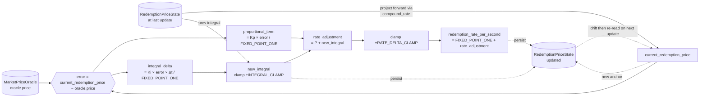

### 6.5 Debt-accrual terminology (quick reference)

The same few names for the fee/debt machinery recur across §4, §5, and §6. Consolidated here.

**Stored values** (written to account data):

- **`normalized_debt_amount`** — a position's debt with interest stripped out: its "shares." Lives in `Position` (one per `(owner, position_nonce)`). Set on `generate_debt` / `repay_debt`, otherwise unchanged — it is never rewritten as time passes. Units: shares.
- **`accumulated_rate_at_last_accrual`** — the stablecoin-per-share multiplier as of the last accrual (the "anchor"). Lives in the global `StabilityFeeAccumulator`. Starts at `FIXED_POINT_ONE`; only ever grows. Units: stablecoin / share.
- **`last_accrued_at`** — unix-seconds timestamp the anchor was last refreshed. Also in `StabilityFeeAccumulator`. Pairs with the anchor so the live value can be projected.
- **`stability_fee_per_second`** — the per-second growth multiplier applied to the accumulator. Lives in `ProtocolParameters`, stored as `(1 + r) × FIXED_POINT_ONE` (just above 1.0). This is what gets compounded.

**Computed on the fly** (never stored; recomputed on read):

- **`current_accumulated_rate`** — the live accumulator now: `accumulated_rate_at_last_accrual × compound_rate(stability_fee_per_second, now − last_accrued_at) / FIXED_POINT_ONE` (§5.3). Units: stablecoin / share.
- **nominal debt** — what a position actually owes now, in stablecoin: `normalized_debt_amount × current_accumulated_rate / FIXED_POINT_ONE` (§6.1). Frozen shares × the live (growing) accumulator, so it grows over time even though the shares don't. Never stored.

**Operations:**

- **`compound_rate(rate, seconds)`** — `rate ^ seconds` in fixed point, via exponentiation-by-squaring (§5.2).
- **`accrue_stability_fee`** — the permissionless "poke" that refreshes the accumulator anchor: rolls the live value into `accumulated_rate_at_last_accrual` and sets `last_accrued_at = now` (§10.2). The only writer of the accumulator besides init and the auto-accrue in `set_stability_fee_per_second`.
- **`FIXED_POINT_ONE`** — the value `1.0` in this system (`10^27`). Every rate / multiplier / price is stored as `actual_value × FIXED_POINT_ONE` (§5.1).

**The redemption-price side mirrors this exactly** — same anchor + per-second-rate + timestamp pattern, projected the same way (§5.3), re-anchored only by its own poke. Different fields:

| Role | Debt / fee side | Redemption-price side |
|---|---|---|
| anchor | `accumulated_rate_at_last_accrual` | `redemption_price_at_last_update` |
| per-second rate | `stability_fee_per_second` | `redemption_rate_per_second` |
| last-touched timestamp | `last_accrued_at` | `last_updated_at` |
| live projection | `current_accumulated_rate` | `current_redemption_price` |
| re-anchored by | `accrue_stability_fee` (§10.2) | `update_redemption_rate` (§10.3) |

## 7. Cross-instruction invariants

These are properties the protocol maintains across every state-changing instruction. Violations indicate a bug.

1. **Vault-position consistency.** After every op, `position.collateral_amount == position.vault.balance` (the `TokenHolding::Fungible.balance` of the vault account).

2. **Stability fee accumulator monotonicity.** `accumulated_rate_at_last_accrual` is monotonically non-decreasing while `stability_fee_per_second ≥ FIXED_POINT_ONE` (enforced by `set_stability_fee_per_second`'s bound check).

3. **Redemption price positivity.** `redemption_price_at_last_update > 0` at all times. Initial value at init must be > 0; the controller's `rate_adjustment` clamp keeps `redemption_rate_per_second > 0`, so subsequent projections stay positive.

4. **Position addressing.** For every `Position` account `P` owned by the stablecoin program, `P.account_id == compute_position_pda(stablecoin_program_id, P.owner_account_id, P.position_nonce)`.

5. **Vault addressing.** For every `Position` account `P`, `P.vault_account_id == compute_vault_pda(stablecoin_program_id, P.account_id)`.

6. **Single collateral.** For every vault account `V`, `V.data` decodes as `TokenHolding::Fungible { definition_id: protocol_parameters.collateral_definition_id, .. }`.

7. **Supply ≤ total open principal.** `stablecoin_definition.total_supply` is the sum of `(stablecoin minted to users) − (stablecoin burned by users)` integrated over `generate_debt` / `repay_debt`. This equals the **mint-side** debt across positions, NOT the nominal debt (which includes accrued fees). The gap `Σ(nominal_debt) − total_supply` is the protocol's accumulated fee credit (RAI's "system surplus" in concept; not materialized on-chain in this design).

8. **Frozen ⇒ debt-extending ops blocked.** `is_frozen = true` implies `open_position`, `generate_debt`, `withdraw_collateral` all panic. Other ops continue to work.

## 8. Bound choices

| Constant / parameter | Bound | Rationale |
|---|---|---|
| `FIXED_POINT_ONE` | `10^27` | RAY precision; standard. |
| `stability_fee_per_second` | `FIXED_POINT_ONE ≤ x ≤ FIXED_POINT_ONE * 2` | Lower bound = no decay (RFP "fees accrue continuously" implies positive rate). Upper bound is an anti-typo sanity cap (≈100%/s) — it does **not** by itself prevent `compound_rate` overflow; that is handled by clamping the elapsed window (`MAXIMUM_COMPOUNDING_WINDOW_SECONDS`, below). Real values are `1 + ε` where `ε ≈ 10^16` for ~5% annual. |
| `minimum_collateralization_ratio` | `FIXED_POINT_ONE * 1.1 ≤ x ≤ FIXED_POINT_ONE * 10` | Lower bound = 110% (any less is liquidation-immediate); upper bound = 1000% (sanity cap). Real values are 130–200%. |
| `controller_proportional_gain` magnitude | `|x| ≤ FIXED_POINT_ONE * 10^6` | Practical upper bound for rate-explosion guard (RFP R2). Real values are tiny (≈10^9–10^15 raw) because they scale price-error × rate-output. |
| `controller_integral_gain` magnitude | Same as proportional | Same rationale. |
| `INTEGRAL_CLAMP` | `± FIXED_POINT_ONE * 10^9` | Anti-windup. Constant in v1; future-promotable to `ProtocolParameters`. |
| `RATE_DELTA_CLAMP` | `± FIXED_POINT_ONE / 100` | Max single-update rate adjustment: ±1% per call. Constant in v1. |
| `minimum_seconds_between_fee_accruals` | `1 ≤ x ≤ 86400` | Min 1s (no zero-spam), max 1 day (RFP "rate updates within a small number of blocks"). |
| `minimum_seconds_between_rate_updates` | Same | Same. |
| `maximum_oracle_price_age_seconds` | `1 ≤ x ≤ 86400` | Stale beyond a day is obviously bad; aggressive freshness is a tuning parameter. |
| `MAXIMUM_COMPOUNDING_WINDOW_SECONDS` | TBD — `≥` the expected worst-case keeper-poke gap (candidate range `86400`–`604800`) | Hard cap on the `dt` passed to `compound_rate` (§5.3), bounding worst-case `rate ^ dt` regardless of the rate value. Necessary because no rate bound alone makes overflow impossible over an unbounded window. Trade-off: fee accrual and redemption drift pause beyond the window under total keeper neglect. Exact value pending tuning. |
| `initial_redemption_price` | `> 0` | Must be positive; admin chooses an initial value reflecting the launch peg target. |

All bounds enforced in `initialize_program` and the corresponding `set_*` instruction.

## 9. Instruction set

18 instructions in 5 groups. Full per-instruction details in § 10.

### 9.1 Bootstrap

| # | Instruction | Caller | One-line |
|---|---|---|---|
| 1 | `initialize_program` | admin (one-shot) | Create all five global PDAs (three native + the stablecoin definition and its paired master holding, both via chained `Token::NewFungibleDefinition`), bind collateral + oracle + initial params, set initial redemption price. |

### 9.2 Permissionless pokes

| # | Instruction | Caller | One-line |
|---|---|---|---|
| 2 | `accrue_stability_fee` | anyone | Roll `StabilityFeeAccumulator` forward to `now` if min interval elapsed. |
| 3 | `update_redemption_rate` | anyone | Read oracle, run PI controller, re-anchor `RedemptionPriceState`. |

### 9.3 Position lifecycle

| # | Instruction | Caller | Frozen | One-line |
|---|---|---|---|---|
| 4 | `open_position` | owner | blocked | Claim Position PDA + vault PDA, deposit initial collateral. |
| 5 | `deposit_collateral` | owner | ok | Add collateral to an existing position. |
| 6 | `withdraw_collateral` | owner | blocked | Remove collateral, subject to collateralization. |
| 7 | `generate_debt` | owner | blocked | Mint stablecoin, increase normalized debt, subject to collateralization. Oracle staleness gate. |
| 8 | `repay_debt` | owner | ok | Burn stablecoin, decrease normalized debt. |
| 9 | `close_position` | owner | ok | Clear Position PDA when debt = 0 and collateral = 0. Vault lingers (see § 14). |

### 9.4 Admin parameter updates

| # | Instruction | Caller | One-line |
|---|---|---|---|
| 10 | `set_stability_fee_per_second` | admin | Auto-accrues first; then updates the rate. |
| 11 | `set_minimum_collateralization_ratio` | admin | Update the safety ratio. |
| 12 | `set_controller_gains` | admin | Update Kp + Ki atomically. |
| 13 | `set_market_price_oracle` | admin | Rotate oracle id; validate new oracle's base/quote. |
| 14 | `set_timing_parameters` | admin | Update the three timing fields atomically. |
| 15 | `set_admin` | admin | One-step admin rotation. |
| 16 | `set_freeze_authority` | admin | One-step freeze authority rotation. |

### 9.5 Emergency

| # | Instruction | Caller | One-line |
|---|---|---|---|
| 17 | `freeze` | freeze authority | Sets `is_frozen = true`. |
| 18 | `unfreeze` | freeze authority | Sets `is_frozen = false`. |

## 10. Per-instruction details

For each instruction below: **inputs** (accounts) with pre-state expectations and authorization requirements; **outputs** (the fields modified per account, plus any chained calls); **panics** (validation conditions that abort the instruction).

### 10.1 `initialize_program`

**Signature:**

```rust
fn initialize_program(
    freeze_authority_account_id: AccountId,
    initial_stability_fee_per_second: u128,
    initial_controller_proportional_gain: i128,
    initial_controller_integral_gain: i128,
    initial_minimum_collateralization_ratio: u128,
    minimum_seconds_between_fee_accruals: u64,
    minimum_seconds_between_rate_updates: u64,
    maximum_oracle_price_age_seconds: u64,
    initial_redemption_price: u128,
    stablecoin_name: String,
);
```

**Inputs (8 accounts):**

1. `admin` — authorized, becomes `ProtocolParameters.admin_account_id`. Pre-state unchanged.
2. `protocol_parameters` — uninitialized, PDA-to-claim (`hash(program_id, "PROTOCOL_PARAMETERS")`).
3. `stability_fee_accumulator` — uninitialized, PDA-to-claim.
4. `redemption_price_state` — uninitialized, PDA-to-claim.
5. `stablecoin_definition` — uninitialized, PDA-to-claim via chained `Token::NewFungibleDefinition`.
6. `stablecoin_master_holding` — uninitialized, PDA-to-claim via the same chained call (Token Program API artifact; receives `total_supply = 0`, never used again).
7. `collateral_definition` — initialized, read-only; persisted into `ProtocolParameters.collateral_definition_id`. Validated as `TokenDefinition::Fungible`.
8. `market_price_oracle` — initialized, read-only. Validated: `OraclePriceAccount`, `base_asset = stablecoin_definition.account_id` (PDA derivation predicted), `quote_asset = collateral_definition.account_id`.

**Outputs:**

- `protocol_parameters` (claimed PDA): all `ProtocolParameters` fields written from the params (including `admin_account_id = admin.account_id`, `is_frozen = false`).
- `stability_fee_accumulator` (claimed PDA): `accumulated_rate_at_last_accrual = FIXED_POINT_ONE`, `last_accrued_at = now`.
- `redemption_price_state` (claimed PDA): `redemption_price_at_last_update = initial_redemption_price`, `redemption_rate_per_second = FIXED_POINT_ONE`, `controller_integral_term = 0`, `last_updated_at = now`.
- `stablecoin_definition` (claimed via chained): `TokenDefinition::Fungible { name: stablecoin_name, total_supply: 0, metadata_id: None }`, owned by Token Program.
- `stablecoin_master_holding` (claimed via chained): `TokenHolding::Fungible { definition_id: stablecoin_definition.account_id, balance: 0 }`, owned by Token Program.

**Chained calls:**

1. `Token::NewFungibleDefinition { name: stablecoin_name, total_supply: 0 }` · accounts: `[stablecoin_definition, stablecoin_master_holding]` (both authorized via their respective stablecoin-program PDA seeds).

**Panics if:** `admin.is_authorized = false`; any of the five target PDAs already initialized; `collateral_definition` uninitialized or not `TokenDefinition::Fungible`; `market_price_oracle` base/quote mismatch; any numerical param outside its sane band (§ 8).

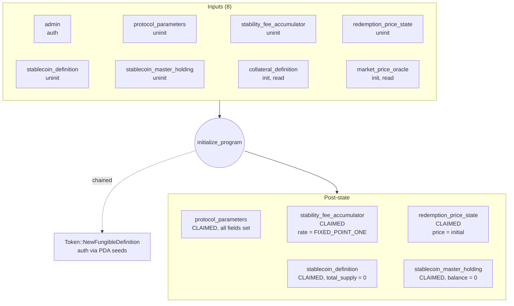

### 10.2 `accrue_stability_fee`

**Signature:** `fn accrue_stability_fee();`

**Inputs (3 accounts):**

1. `caller` — authorized; satisfies runtime's ≥1-authorized requirement. Not retained.
2. `protocol_parameters` — initialized, read-only.
3. `stability_fee_accumulator` — initialized, writable.

**Output state changes:**

- `stability_fee_accumulator.accumulated_rate_at_last_accrual` ← `anchor × compound_rate(stability_fee_per_second, now − last_accrued_at) / FIXED_POINT_ONE`
- `stability_fee_accumulator.last_accrued_at` ← `now`

**Chained calls:** none.

**Panics if:** `caller.is_authorized = false`; either global uninitialized; `now − last_accrued_at < minimum_seconds_between_fee_accruals`; overflow in `compound_rate` (prevented by the `MAXIMUM_COMPOUNDING_WINDOW_SECONDS` clamp of §5.3 — without it a within-bounds-but-high rate over a long `dt` would overflow).

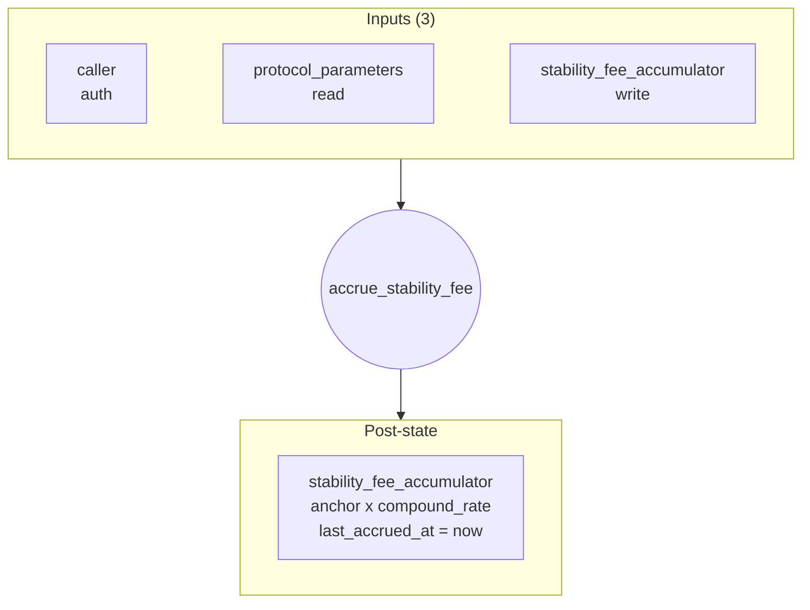

### 10.3 `update_redemption_rate`

**Signature:** `fn update_redemption_rate();`

**Inputs (4 accounts):**

1. `caller` — authorized.
2. `protocol_parameters` — initialized, read-only.
3. `redemption_price_state` — initialized, writable.
4. `market_price_oracle` — initialized, read-only. Must equal `protocol_parameters.market_price_oracle_id`.

**Output state changes (`redemption_price_state` only):** per § 6.4.

**Chained calls:** none.

**Panics if:** `caller.is_authorized = false`; any input uninitialized / wrong owner; oracle id mismatch; `now − oracle.timestamp > maximum_oracle_price_age_seconds`; `oracle.price = 0`; `now − last_updated_at < minimum_seconds_between_rate_updates`.

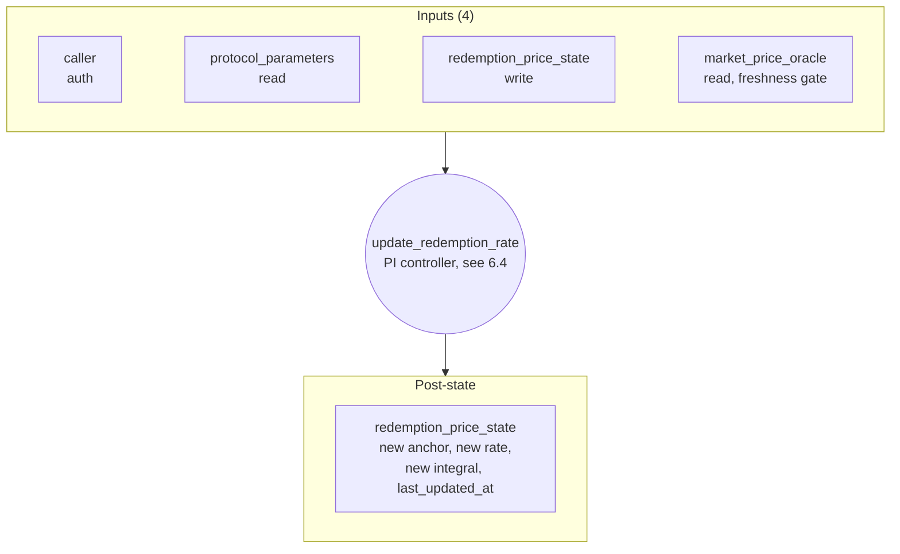

### 10.4 `open_position`

**Signature:** `fn open_position(position_nonce: u64, initial_collateral_amount: u128);`

**Inputs (6 accounts):**

1. `owner` — authorized; becomes `position.owner_account_id`.
2. `position` — uninitialized; PDA `hash(program_id, hash(owner.account_id, position_nonce))`.
3. `vault` — uninitialized; PDA `hash(program_id, hash(position.account_id))`.
4. `user_collateral_holding` — authorized, initialized; `TokenHolding::Fungible` with `definition_id = collateral_definition.account_id` and `balance ≥ initial_collateral_amount`.
5. `collateral_definition` — initialized, read-only; must equal `protocol_parameters.collateral_definition_id`. Required by the chained `Token::InitializeAccount`.
6. `protocol_parameters` — initialized, read-only. Reads `collateral_definition_id` + `is_frozen`.

**Outputs:**

- `position` (claimed PDA): `owner_account_id = owner.account_id`, `position_nonce = position_nonce`, `vault_account_id = vault.account_id`, `collateral_amount = initial_collateral_amount`, `normalized_debt_amount = 0`, `opened_at = now`.
- `vault` (claimed via chained `Token::InitializeAccount` then balance updated by chained `Token::Transfer`): final `TokenHolding::Fungible { definition_id: collateral_definition.account_id, balance: initial_collateral_amount }`.
- `user_collateral_holding`: `balance` decreased by `initial_collateral_amount`.

**Chained calls:**

1. `Token::InitializeAccount` · accounts: `[collateral_definition, vault (auth via vault PDA seed)]` · pda_seeds: `[vault_seed]`.
2. `Token::Transfer { amount: initial_collateral_amount }` · accounts: `[user_collateral_holding (user-authorized), vault]` · no PDA seeds.

**Panics if:** `owner.is_authorized = false`; `user_collateral_holding.is_authorized = false`; position or vault already initialized; `collateral_definition.account_id ≠ protocol_parameters.collateral_definition_id`; user holding's `definition_id` mismatch or different Token Program; position / vault PDA derivation mismatch; `protocol_parameters.is_frozen = true`.

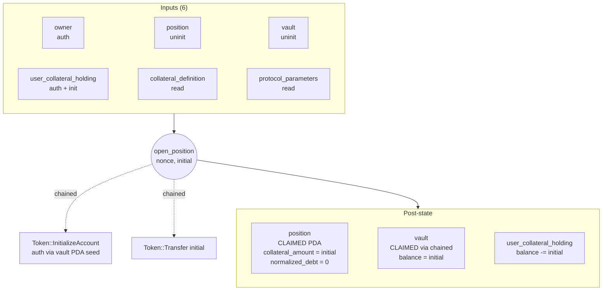

### 10.5 `deposit_collateral`

**Signature:** `fn deposit_collateral(amount: u128);`

**Inputs (5 accounts):**

1. `owner` — authorized.
2. `position` — initialized, writable; PDA verified against `(owner, position.position_nonce)`.
3. `vault` — initialized, writable; must equal `position.vault_account_id`.
4. `user_collateral_holding` — authorized, initialized; `definition_id = protocol_parameters.collateral_definition_id`; same Token Program as the vault.
5. `protocol_parameters` — initialized, read-only.

**Outputs:**

- `position.collateral_amount` ← `old + amount`.
- `vault.balance` ← `old + amount` (via chained `Token::Transfer`).
- `user_collateral_holding.balance` ← `old − amount` (same chained call).

**Chained calls:** `Token::Transfer { amount }` · accounts: `[user_collateral_holding (user-authorized), vault]` · no PDA seeds.

**Panics if:** `owner.is_authorized = false`; `user_collateral_holding.is_authorized = false`; position uninit / wrong owner / PDA mismatch; vault doesn't match `position.vault_account_id`; user holding's `definition_id` mismatch or different Token Program; `position.collateral_amount + amount` overflows. Allowed when frozen.

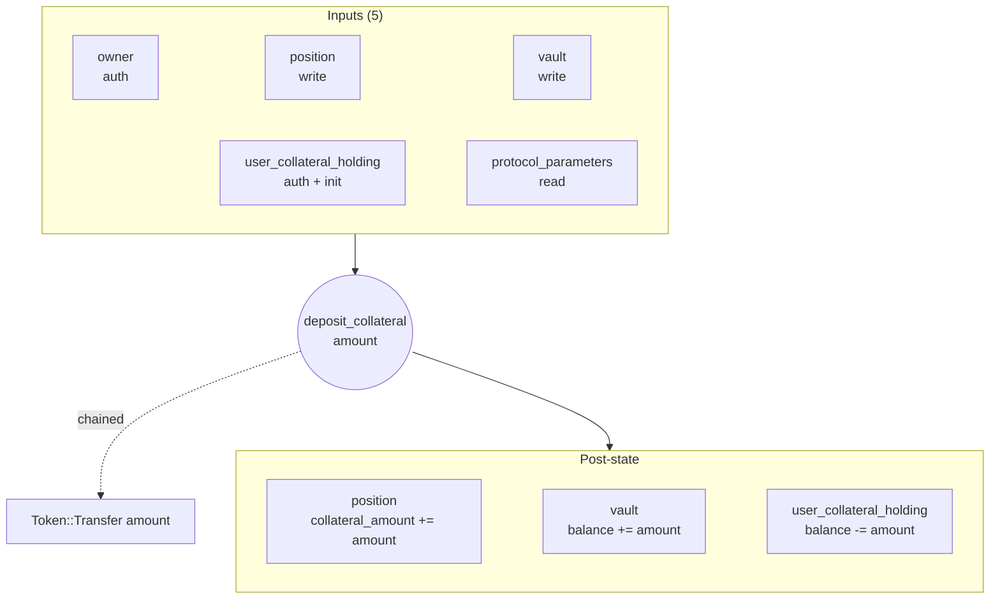

### 10.6 `withdraw_collateral`

**Signature:** `fn withdraw_collateral(amount: u128);`

**Inputs (7 accounts):**

1. `owner` — authorized.
2. `position` — initialized, writable; PDA verified.
3. `vault` — initialized, writable; auth via vault PDA seed in the chained call.
4. `user_collateral_holding` — initialized (destination); NOT required to be authorized.
5. `stability_fee_accumulator` — initialized, read-only; for current accumulator → nominal debt.
6. `redemption_price_state` — initialized, read-only; for current redemption price.
7. `protocol_parameters` — initialized, read-only.

**Outputs:**

- `position.collateral_amount` ← `old − amount`.
- `vault.balance` ← `old − amount`.
- `user_collateral_holding.balance` ← `old + amount`.

**Chained calls:** `Token::Transfer { amount }` · accounts: `[vault (auth via vault PDA seed), user_collateral_holding]` · pda_seeds: `[vault_seed]`.

**Panics if:** `owner.is_authorized = false`; position uninit / wrong owner / PDA mismatch; vault doesn't match `position.vault_account_id`; user holding's `definition_id` mismatch or different Token Program; `protocol_parameters.is_frozen = true`; `amount > position.collateral_amount`; collateralization check (§ 6.2) fails post-decrement.

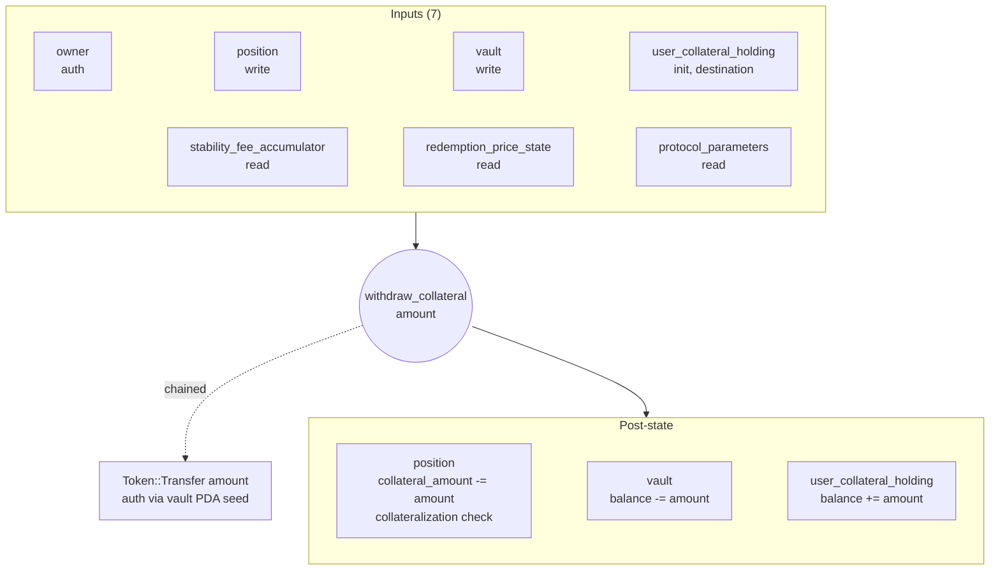

### 10.7 `generate_debt`

**Signature:** `fn generate_debt(amount: u128);`

**Inputs (8 accounts):**

1. `owner` — authorized.
2. `position` — initialized, writable; PDA verified.
3. `stablecoin_definition` — initialized, writable (chained Mint); must equal `protocol_parameters.stablecoin_definition_id`.
4. `user_stablecoin_holding` — initialized; `definition_id = stablecoin_definition.account_id`; same Token Program. NOT required to be authorized (Mint destination).
5. `stability_fee_accumulator` — initialized, read-only.
6. `redemption_price_state` — initialized, read-only.
7. `market_price_oracle` — initialized, read-only; for staleness gate only. Must equal `protocol_parameters.market_price_oracle_id`.
8. `protocol_parameters` — initialized, read-only.

**Outputs:**

- `position.normalized_debt_amount` ← `old + ⌈amount × FIXED_POINT_ONE / current_accumulator⌉` (round UP, § 6.3).
- `stablecoin_definition.total_supply` ← `old + amount` (chained Mint).
- `user_stablecoin_holding.balance` ← `old + amount` (chained Mint).

**Chained calls:** `Token::Mint { amount_to_mint: amount }` · accounts: `[stablecoin_definition (auth via stablecoin program PDA seed), user_stablecoin_holding]` · pda_seeds: `[stablecoin_definition_seed]`.

**Panics if:** `owner.is_authorized = false`; position uninit / wrong owner / PDA mismatch; `stablecoin_definition.account_id ≠ protocol_parameters.stablecoin_definition_id`; user holding's `definition_id` mismatch or different Token Program; `market_price_oracle.account_id ≠ protocol_parameters.market_price_oracle_id`; `now − oracle.timestamp > maximum_oracle_price_age_seconds`; `protocol_parameters.is_frozen = true`; collateralization check (§ 6.2) fails post-mint; arithmetic overflow.

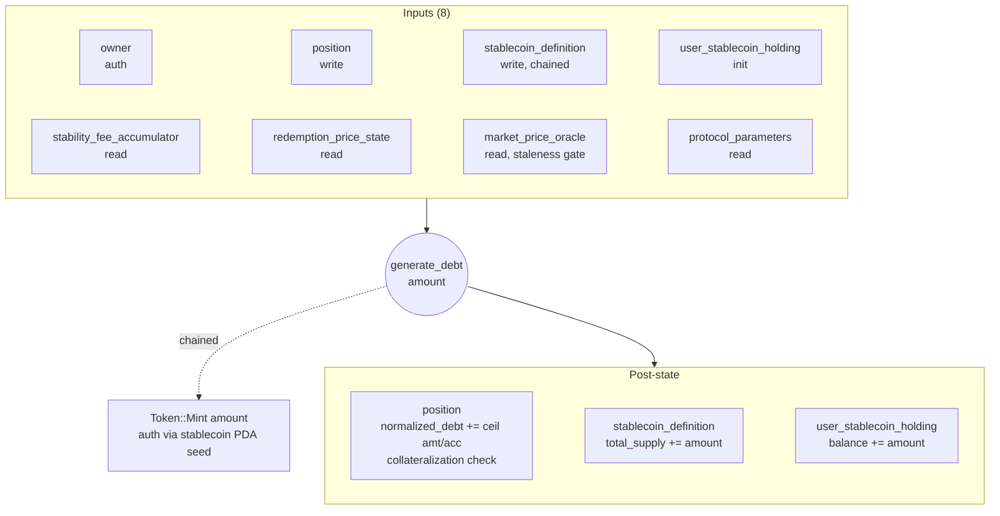

### 10.8 `repay_debt`

**Signature:** `fn repay_debt(amount: u128);`

**Inputs (6 accounts):**

1. `owner` — authorized.
2. `position` — initialized, writable; PDA verified.
3. `stablecoin_definition` — initialized, writable (chained Burn); must equal `protocol_parameters.stablecoin_definition_id`.
4. `user_stablecoin_holding` — authorized, initialized; `definition_id = stablecoin_definition.account_id`; same Token Program.
5. `stability_fee_accumulator` — initialized, read-only.
6. `protocol_parameters` — initialized, read-only.

**Outputs:**

- `position.normalized_debt_amount` ← `old − ⌊amount × FIXED_POINT_ONE / current_accumulator⌋` (round DOWN, § 6.3); `checked_sub` panics on overrepay.
- `stablecoin_definition.total_supply` ← `old − amount`.
- `user_stablecoin_holding.balance` ← `old − amount`.

**Chained calls:** `Token::Burn { amount_to_burn: amount }` · accounts: `[stablecoin_definition, user_stablecoin_holding (user-authorized)]` · no PDA seeds.

**Panics if:** `owner.is_authorized = false`; `user_stablecoin_holding.is_authorized = false`; position uninit / wrong owner / PDA mismatch; `stablecoin_definition.account_id ≠ protocol_parameters.stablecoin_definition_id`; user holding's `definition_id` mismatch or different Token Program; overrepay (`⌊amount × FIXED_POINT_ONE / current_accumulator⌋ > position.normalized_debt_amount`, mirroring the floor decrement of §6.3 / the output above). Allowed when frozen.

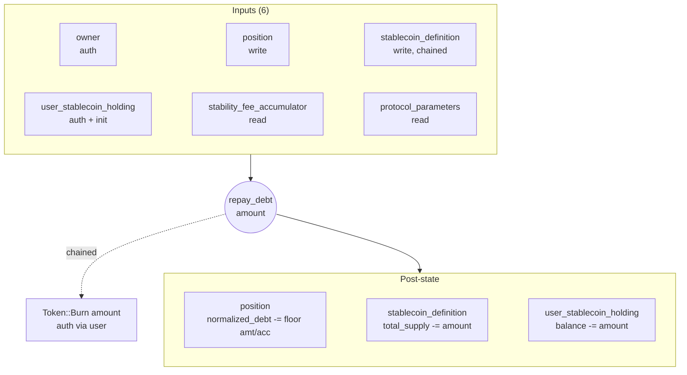

### 10.9 `close_position`

**Signature:** `fn close_position();`

**Inputs (4 accounts):**

1. `owner` — authorized.
2. `position` — initialized, to-be-cleared; PDA verified.
3. `vault` — initialized, read-only; must equal `position.vault_account_id`; `balance = 0` asserted.
4. `protocol_parameters` — initialized, read-only.

**Outputs:**

- `position` ← `Account::default()` (cleared; PDA released).
- `vault` unchanged — lingers with `balance = 0` (Token Program has no `CloseHolding`; § 14).

**Chained calls:** none.

**Panics if:** `owner.is_authorized = false`; position uninit / wrong owner / PDA mismatch; `position.normalized_debt_amount ≠ 0`; `position.collateral_amount ≠ 0`; vault account_id mismatch; `vault.balance ≠ 0`. Allowed when frozen.

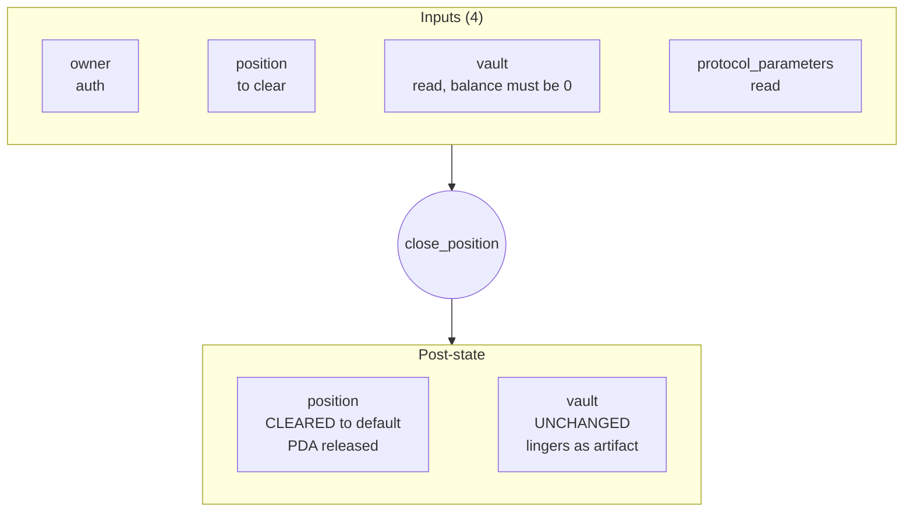

### 10.10–10.16 Admin parameter updates

#### Capabilities at a glance

Every settable thing in the protocol, what it starts as, and who/how it can change:

| Field | Init source | Modifiable later? |
|---|---|---|
| `admin_account_id` | the `admin` account that signed init | yes — `set_admin` (one-step rotation) |
| `freeze_authority_account_id` | param to init | yes — `set_freeze_authority` |
| `stablecoin_definition_id` | PDA claimed at init | **NO — immutable** (changing breaks supply accounting) |
| `collateral_definition_id` | param to init | **NO — immutable** (changing orphans every vault) |
| `market_price_oracle_id` | param to init | yes — `set_market_price_oracle` (validates new oracle's base/quote) |
| `stability_fee_per_second` | param to init | yes — `set_stability_fee_per_second` (auto-accrues at OLD rate first) |
| `controller_proportional_gain` | param to init | yes — `set_controller_gains` (bundled with Ki) |
| `controller_integral_gain` | param to init | yes — `set_controller_gains` (bundled with Kp) |
| `minimum_collateralization_ratio` | param to init | yes — `set_minimum_collateralization_ratio` |
| `minimum_seconds_between_fee_accruals` | param to init | yes — `set_timing_parameters` (bundled) |
| `minimum_seconds_between_rate_updates` | param to init | yes — `set_timing_parameters` (bundled) |
| `maximum_oracle_price_age_seconds` | param to init | yes — `set_timing_parameters` (bundled) |
| `is_frozen` | always `false` at init | toggled by `freeze` / `unfreeze` (freeze_authority, not admin) |
| `redemption_price_at_last_update` | param to init (initial price) | **not directly settable by admin** — only drifts via `update_redemption_rate` (controller) |
| `redemption_rate_per_second` | always `FIXED_POINT_ONE` at init | controller-managed (only `update_redemption_rate` writes it) |
| `controller_integral_term` | always `0` at init | controller-managed (only `update_redemption_rate` writes it) |
| `accumulated_rate_at_last_accrual` | always `FIXED_POINT_ONE` at init | grows monotonically via `accrue_stability_fee` and the auto-accrue in `set_stability_fee_per_second` |
| `stablecoin name` | param to init | **NO — immutable** (lives in `TokenDefinition::Fungible`; no token-program setter) |

**What admin CAN do:**

- Rotate the admin and freeze-authority handles.
- Tune the stability fee (with auto-accrue: new rate applies only from `now` forward, never retroactively to the elapsed gap).
- Tune the controller gains (Kp / Ki), without resetting the integral term.
- Tune the minimum collateralization ratio. Tightening leaves existing positions retroactively under-collateralized — they can `deposit_collateral` or `repay_debt` to recover, but cannot `withdraw_collateral` or `generate_debt` until they're back above the new ratio.
- Rotate the market-price oracle to a new account (validates the new oracle's base/quote pair, does not pin its `program_owner` — so any producer that emits an `OraclePriceAccount` with the right shape works).
- Tune the timing parameters (accrual interval, rate-update interval, oracle staleness threshold).

**What admin CANNOT do:**

- Change the stablecoin definition or the collateral definition. Those are locked at init; the rationale is in §4.1 (changing either breaks accounting that's already on-chain).
- Change the stablecoin name (held inside the immutable `TokenDefinition::Fungible`).
- Reset the redemption price (no admin override — only the controller drifts it; an admin escape hatch was deliberately rejected since it would let a compromised admin reprice the system arbitrarily).
- Reset the controller integral term.
- Mint or burn stablecoin directly. The only minting/burning paths are `generate_debt` / `repay_debt`, which are user-driven and gated by collateralization.
- Modify any position's fields. Positions are owner-authorized only.
- Freeze or unfreeze the protocol. That's the freeze authority's job.

**What freeze_authority CAN do:** call `freeze` or `unfreeze`. Nothing else.

**Trust assumption:** an admin (and the freeze authority) is fully trusted within these capabilities. A malicious admin can stop new debt generation by tightening the ratio, drain the protocol's safety by setting a permissive ratio, or front-run users by rotating to a malicious oracle. Mitigations rely on external operational practice (multisig / timelock around the admin handle), the independent freeze authority as a kill switch, and the future RFP-001 / RFP-002 wrappers when they land.

#### Shared skeleton

All seven share the same skeleton:

**Inputs (2 base + 0-1 extras):**

- `admin` — authorized; `admin.account_id == protocol_parameters.admin_account_id`.
- `protocol_parameters` — initialized, writable.

**Output:** exactly the field(s) listed below are overwritten on `protocol_parameters`; everything else unchanged.

**Panics if:** `admin.is_authorized = false`; admin handle mismatch; protocol_parameters uninit / wrong owner; new value outside its sane band (§ 8).

| # | Instruction | Param(s) | Fields rewritten | Extra accounts | Special note |
|---|---|---|---|---|---|
| 10 | `set_stability_fee_per_second` | `new_rate: u128` | `stability_fee_per_second` | `stability_fee_accumulator` (writable) | Auto-accrues forward at the OLD rate up to `now` first. |
| 11 | `set_minimum_collateralization_ratio` | `new_ratio: u128` | `minimum_collateralization_ratio` | — | Tightening leaves existing positions retroactively under-collateralized; they cannot increase debt or withdraw collateral until back above. No mass-liquidation here (RFP-014 out of scope). |
| 12 | `set_controller_gains` | `new_proportional_gain: i128, new_integral_gain: i128` | `controller_proportional_gain`, `controller_integral_gain` | — | Does NOT reset `controller_integral_term`. |
| 13 | `set_market_price_oracle` | (no scalar) | `market_price_oracle_id` | `new_oracle` (read-only) | Validates `OraclePriceAccount` shape, base/quote ids. `program_owner` not pinned. |
| 14 | `set_timing_parameters` | three `u64`s | `minimum_seconds_between_fee_accruals`, `minimum_seconds_between_rate_updates`, `maximum_oracle_price_age_seconds` | — | Bundled. |
| 15 | `set_admin` | `new_admin_account_id: AccountId` | `admin_account_id` | — | One-step rotation. |
| 16 | `set_freeze_authority` | `new_freeze_authority_account_id: AccountId` | `freeze_authority_account_id` | — | One-step rotation. |

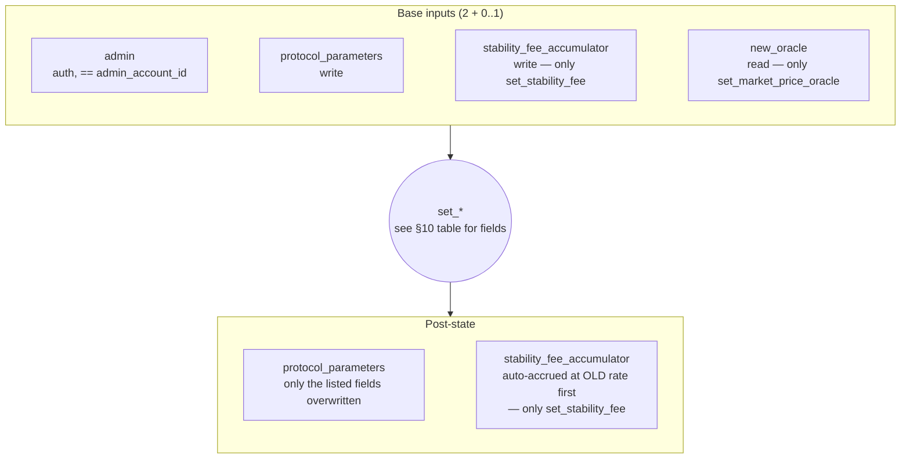

### 10.17–10.18 `freeze` / `unfreeze`

**Inputs (2 accounts):**

- `freeze_authority` — authorized; `freeze_authority.account_id == protocol_parameters.freeze_authority_account_id`.
- `protocol_parameters` — initialized, writable.

**Output:** `protocol_parameters.is_frozen` ← `true` (freeze) or `false` (unfreeze). Idempotent.

**Panics if:** auth check fails; protocol_parameters uninit / wrong owner.

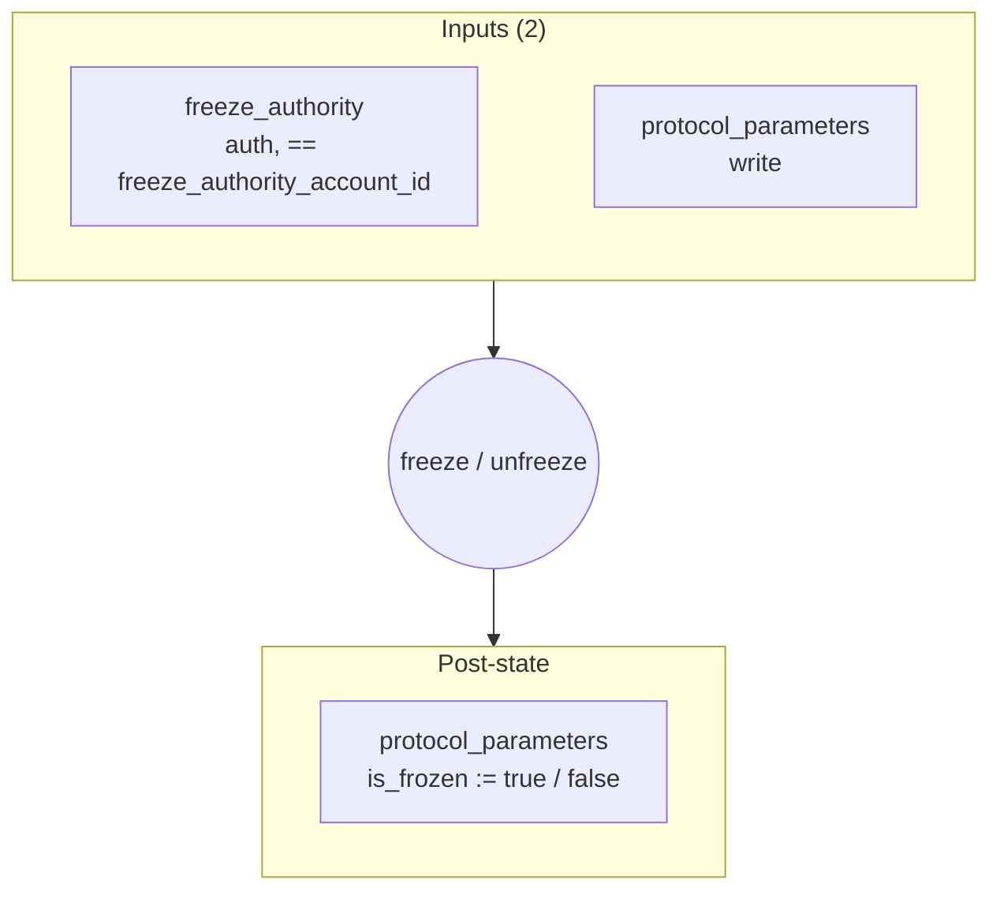

## 11. Edge cases

- **Empty position** (`collateral_amount = 0`, `normalized_debt_amount = 0`) — valid intermediate state. `withdraw_collateral` with `amount = 0` is a no-op. `close_position` is the only path that clears the account.
- **Long time since last poke.** `compound_rate` handles large `dt` via exponentiation by squaring (O(log dt)), but the result is NOT self-bounding: at extreme `dt` any rate > `FIXED_POINT_ONE` overflows. Callers therefore clamp `dt` to `MAXIMUM_COMPOUNDING_WINDOW_SECONDS` (§5.3). The trade-off is that fee accrual and redemption drift pause beyond the window if no one pokes for that long; permissionless, cheap pokes make this a catastrophic-neglect-only scenario.
- **Stale oracle but unfrozen.** `update_redemption_rate` panics, so the rate stops drifting at whatever it last was. `generate_debt` also panics (RFP R3). Existing positions, `deposit_collateral`, `repay_debt`, `withdraw_collateral` all continue. Withdrawing requires the collateralization check, which uses the projected redemption price from the OLD rate — operationally fine.
- **Frozen + stale oracle.** `withdraw_collateral` blocked (frozen). `generate_debt` blocked twice (frozen + stale). `deposit_collateral`, `repay_debt`, `close_position` work. Anyone can still call `accrue_stability_fee` (rate-independent).
- **Admin tightens `minimum_collateralization_ratio`.** Existing positions with healthy-old-ratio but underwater-new-ratio cannot `generate_debt` or `withdraw_collateral`. They CAN `deposit_collateral` to recover, or `repay_debt` to reduce their debt.
- **Position re-open at same nonce after close.** Fails — the vault PDA at `hash(position_id)` lingers from before. Workaround: pick a fresh nonce. See § 14.
- **Overrepay on `repay_debt`.** Panics via `checked_sub`; protects against user error sending more burn than nominal debt at this instant.
- **Dust on full repay.** Because the decrement is rounded down (§6.3), burning exactly the current nominal debt may leave a tiny `normalized_debt_amount` residue (≤ one accumulator unit). To fully clear, users overpay by a tiny amount (≤ accumulator × 1 raw unit). Off-chain SDK computes the right number; if it picks too small, `repay_debt` still succeeds but the position isn't closeable until another small repay.
- **Zero-amount instructions.** `deposit_collateral(0)`, `withdraw_collateral(0)`, `generate_debt(0)`, `repay_debt(0)`: all valid no-ops at the protocol level (chained Token call is also a no-op). Saves the caller from having to short-circuit.

## 12. Out of scope (per RFP)

- **Liquidation mechanism** — addressed by RFP-014.
- **Surplus / debt management auctions** — addressed by RFP-014.
- **Multi-collateral positions** — single instance, single collateral per deployment.
- **Privacy-private state positions** — privacy is enforced at the UX layer in this design's downstream specs (mini-app / SDK), not on-chain.
- **Governance token design** — admin and freeze authority are plain `AccountId` handles in this RFP; governance machinery is its own project.
- **CLI, mini-app, SDK** — separate specs, downstream of this one.

## 13. Forward integration

- **RFP-014 (Liquidation & Auction Engine).** Adds an external "liquidator" program that, when a position falls under `minimum_collateralization_ratio`, may seize its collateral and clear its debt. Cleanest fit: a new instruction `liquidate_position` callable by the liquidator program (gated by checking the position's collateralization), or by extending the existing instructions to support a `liquidate_only_path`. Either way, this design's `normalized_debt_amount` and `current_accumulator` carry over directly. Surplus accounting (the gap of § 7 invariant 7) materializes here when auctions land.
- **RFP-001 (Admin Authority).** When RFP-001 ships, `admin_account_id` either points at the admin program's account (and any `set_*` instruction's `admin` input is that account being authorized by that program) or this RFP grows a wrapper. Either way it's a local change: `set_*` instructions become "admin authority program authorizes this account" rather than "this account is `is_authorized`". No data-model migration needed.
- **RFP-002 (Freeze Authority).** Same pattern for `freeze_authority_account_id`.
- **Mini-app / CLI / SDK.** Read the on-chain accounts directly to display: position-level collateralization, redemption price drift, projected outcomes (these are SDK functions over the same math in § 6). The deshield-interact-reshield privacy pattern is the SDK's responsibility; the program is unaware of whether callers are ephemeral or persistent.

## 14. Open follow-ups (not blocking this design)

- **`Token::CloseHolding`.** Upstream extension to the token program. Lets `close_position` actually clear the vault account so position-nonce reuse becomes possible. Track as a separate issue against the Token Program.
- **Two-step admin / freeze rotation.** `set_admin` / `set_freeze_authority` could grow `pending_*` fields + `accept_*` instructions to protect against typo'd `set_admin`. Not in this RFP.
- **Promote `INTEGRAL_CLAMP` and `RATE_DELTA_CLAMP` to admin-tunable.** Constants for v1 to keep the surface small. Promotion is additive (new `ProtocolParameters` fields + new admin setters); no migration of existing state.
- **Leaky integrator (RAI parity).** v1 uses a hard `INTEGRAL_CLAMP` for anti-windup (§6.4); RAI uses a per-second integral *leak* (`perSecondCumulativeLeak`) that exponentially decays stale deviation. Switching to the leak — better dynamics under sustained deviations, at the cost of a new tunable parameter (with its own §8 bound) and a change to the §6.4 integral math — is deferred to the controller-tuning pass (§15). Deliberate divergence, not an oversight.
- **Liquidation-specific instructions.** Tracked under RFP-014.
- **Surplus extraction.** When RFP-014 lands, the implicit fee credit (§ 7 invariant 7) becomes extractable. May require a one-shot `materialize_surplus` instruction that mints the gap into a designated holding.

## 15. Implementation plan handoff

This design is the input to the writing-plans skill. The plan should:

1. Decompose the 18 instructions into landable issues (per-instruction or small bundles) with clear deps.
2. Account for the data-model migration from the current scaffold (`Position` field renames + the global PDAs that don't exist yet).
3. Include the `idl-gen` regeneration step per the `Makefile` `idl` target.
4. Include integration test coverage for the multi-step flows (open → generate → repay → close, oracle staleness scenarios, frozen scenarios, admin parameter sweeps).
5. Lock the actual numerical bounds of § 8 before they're hardcoded into the program (review with operations / risk).

## 16. Sample scenarios

Two end-to-end walkthroughs showing how the relevant fields change over time. Numbers are illustrative — scaled-down magnitudes so the arithmetic stays readable. Real deployments would use atomic-unit scales (`u128`).

### 16.1 Alice's full lifecycle

Alice opens a collateralized position, borrows stablecoin, holds for ~1 year, accrues fees, repays everything, withdraws her collateral, and closes the position.

**Setup (t = 0, just after a long-running protocol)**

- `ProtocolParameters`: `stability_fee_per_second` set for ~5%/year, `minimum_collateralization_ratio = 1.5 × FIXED_POINT_ONE`, oracle wired to a TWAP producer.
- `StabilityFeeAccumulator`: `accumulated_rate_at_last_accrual = 1.0 × FIXED_POINT_ONE`, `last_accrued_at = 0` (assume keepers will catch up).
- `RedemptionPriceState`: `redemption_price_at_last_update = 0.5 × FIXED_POINT_ONE` (collateral-per-stablecoin), `redemption_rate_per_second = FIXED_POINT_ONE`, `controller_integral_term = 0`.
- Alice's collateral holding: `balance = 1000`. Alice's stablecoin holding: doesn't exist yet (she'll initialize it before `generate_debt`).

**Step 1 — t = 0s: `open_position(nonce = 7, initial_collateral_amount = 600)`**

| Account | Field | Before | After |
|---|---|---|---|
| `position` (Alice, 7) | (the whole account) | `Account::default()` | `Position{ owner=Alice, nonce=7, vault=<derived>, collateral_amount=600, normalized_debt_amount=0, opened_at=0 }`, program_owner = stablecoin |
| `vault` (PDA from position) | balance | uninit | 600 |
| Alice's collateral holding | balance | 1000 | 400 |

No oracle / accumulator / redemption-price reads in this op — opening a fresh position with no debt is "deposit_collateral plus a PDA claim".

**Step 2 — t = 10s: Alice initializes her stablecoin holding (separate Token-program tx, not shown), then calls `generate_debt(amount = 200)`**

State of globals at t=10s:
- `current_accumulated_rate(t=10) ≈ 1.0 × FIXED_POINT_ONE` (negligible drift in 10 seconds).
- `current_redemption_price(t=10) ≈ 0.5 × FIXED_POINT_ONE`.
- Oracle is fresh.

Computation:
- `delta_normalized = ⌈200 × FIXED_POINT_ONE / current_accumulator⌉ ≈ ⌈200⌉ = 200` (no rounding loss yet).
- Collateralization check: `collateral_value_in_stablecoin = 600 / 0.5 = 1200`; `required = 200 × 1.5 = 300`; `1200 ≥ 300` ✓.

| Account | Field | Before | After |
|---|---|---|---|
| `position` | normalized_debt_amount | 0 | 200 |
| `stablecoin_definition` | total_supply | S | S + 200 |
| Alice's stablecoin holding | balance | 0 | 200 |

**Step 3 — t = 365 days (one year of permissionless keepers calling `accrue_stability_fee` periodically)**

The accumulator has compounded: at 5%/year stability fee, `accumulated_rate ≈ 1.0513 × FIXED_POINT_ONE` after a year.

Alice's position is **unchanged structurally** — `normalized_debt_amount` still 200, `collateral_amount` still 600. But her **nominal debt** is now:

- `nominal_debt = 200 × 1.0513 ≈ 210.26` stablecoins.

Globals look like (after the year of pokes):
- `StabilityFeeAccumulator.accumulated_rate_at_last_accrual ≈ 1.0513 × FIXED_POINT_ONE`, `last_accrued_at = 365 days`.
- `RedemptionPriceState`: the controller has drifted it based on observed market vs target. For this scenario, say it ended at `0.502 × FIXED_POINT_ONE`.

**Step 4 — t = 365 days + 1s: Alice acquires ~10.3 extra stablecoin from the market (e.g., buys from another user who borrowed) and calls `repay_debt(amount = 211)`**

Computation:
- `current_accumulator ≈ 1.0513 × FIXED_POINT_ONE` (no new accrue in 1s).
- `delta_normalized = ⌊211 × FIXED_POINT_ONE / 1.0513×FIXED_POINT_ONE⌋ = ⌊200.7⌋ = 200`.
- `position.normalized_debt_amount := 200 − 200 = 0`. Cleared.

| Account | Field | Before | After |
|---|---|---|---|
| `position` | normalized_debt_amount | 200 | 0 |
| `stablecoin_definition` | total_supply | S + 200 | S − 11 (net) |
| Alice's stablecoin holding | balance | 211 | 0 |

Alice slightly overpaid (211 nominal vs 210.26 owed). The extra 0.74 went to the protocol as fee credit (this is the rounding remainder; in real magnitudes it's negligible).

**Step 5 — t = 365 days + 2s: `withdraw_collateral(amount = 600)`**

- Position has zero nominal debt → collateralization check trivially passes for any withdrawal up to `collateral_amount`.

| Account | Field | Before | After |
|---|---|---|---|
| `position` | collateral_amount | 600 | 0 |
| `vault` | balance | 600 | 0 |
| Alice's collateral holding | balance | 400 | 1000 |

**Step 6 — t = 365 days + 3s: `close_position()`**

- Preconditions: `normalized_debt_amount = 0` ✓, `collateral_amount = 0` ✓, `vault.balance = 0` ✓.

| Account | Field | Before | After |
|---|---|---|---|
| `position` | (all fields) | `Position{ collateral=0, debt=0, ... }` | `Account::default()` |
| `vault` | — | TokenHolding with balance=0 | UNCHANGED (lingers as artifact, see §14) |

**Net result over the year:**

- Alice locked 600 collateral, borrowed 200 stablecoin, repaid 211 stablecoin. Net cost: ~11 stablecoin (the protocol's accrued stability fee).
- The protocol's "accumulated fee credit" gap (§7 invariant 7) grew by ~11 over the year just from Alice's position. Over thousands of positions, this is the fee revenue the protocol implicitly holds. Surplus extraction is a future-RFP capability (§14).

### 16.2 Emergency freeze

A misbehaving oracle and the freeze authority's response.

**Setup (t = T, normal operation)**

- Alice and Bob both have positions with debt. Say Alice has `normalized_debt = 200`, Bob has `normalized_debt = 500`.
- Current accumulator ≈ `1.05 × FIXED_POINT_ONE`. Current redemption price ≈ `0.5 col/sc`.
- Market price oracle has been reporting `0.49–0.51 col/sc` for weeks, in-band with the target.

**Step 1 — t = T + 100s: Oracle bug — `oracle.price` reports `0.0001 col/sc`**

A keeper calls `update_redemption_rate()`. Oracle staleness check passes (timestamp fresh).

- `error = current_redemption_price − oracle.price = 0.5 − 0.0001 ≈ 0.5` (in fixed-point).
- Controller computes massive negative `rate_adjustment`, hits `RATE_DELTA_CLAMP` floor at −1% per call.
- `RedemptionPriceState`: rate now `0.99 × FIXED_POINT_ONE` (decay), price anchor rolled forward to `~0.5`, integral term grew negatively, last_updated_at = T + 100.

| Account | Field | Before | After |
|---|---|---|---|
| `RedemptionPriceState` | redemption_rate_per_second | ~`FIXED_POINT_ONE` | `0.99 × FIXED_POINT_ONE` (clamped) |
| `RedemptionPriceState` | controller_integral_term | ~0 | large negative (clamped to `-INTEGRAL_CLAMP`) |
| `RedemptionPriceState` | last_updated_at | T | T + 100 |

The redemption price will now drift DOWN at 1%/second from `~0.5`. After 60 seconds, it's roughly `0.5 × 0.99^60 ≈ 0.27`.

**Step 2 — t = T + 200s: Attacker spots the oracle problem and calls `generate_debt(amount = 1_000_000_000)` against a tiny position**

- Oracle staleness check passes (still fresh, that's the problem).
- `current_redemption_price ≈ 0.5 × 0.99^100 ≈ 0.37`.
- Attacker's collateral of, say, 100 atomic units appears to cover `100 / 0.37 / 1.5 ≈ 180` stablecoin debt.
- The 1_000_000_000 generate_debt would fail collateralization. But a more careful attacker with a more meaningful collateral position could mint a lot more than they otherwise could.

Assume attacker mints 500 stablecoin against 100 collateral (would have failed at the real price of 0.5). At the drifted-down price of 0.37 it passes:
- Required = 500 × 0.37 × 1.5 = 277. Attacker has 100. **Actually this still fails.**

OK let's say the controller had been hammered harder and redemption_price dropped to `0.1`. Then 500 stablecoin debt requires `500 × 0.1 × 1.5 = 75` collateral. Attacker mints with 75 collateral. ✓ This now passes.

The attacker dumps the 500 stablecoin on the market for collateral, walking away with extra. The protocol is left holding an under-collateralized position whose nominal debt is real but whose collateral is dust.

**Step 3 — t = T + 500s: Freeze authority notices and calls `freeze()`**

| Account | Field | Before | After |
|---|---|---|---|
| `ProtocolParameters` | is_frozen | false | true |

Effect:
- `generate_debt` — BLOCKED ✓ (no more attacker mints).
- `withdraw_collateral` — BLOCKED ✓ (attacker can't pull collateral against the bad price).
- `deposit_collateral` — allowed (Alice and Bob can shore up).
- `repay_debt` — allowed (Alice and Bob can deleverage).
- `close_position` — allowed.
- `accrue_stability_fee`, `update_redemption_rate` — allowed.

**Step 4 — t = T + 1 hour: Admin calls `set_market_price_oracle(new_good_oracle)`**

| Account | Field | Before | After |
|---|---|---|---|
| `ProtocolParameters` | market_price_oracle_id | bad_oracle | new_good_oracle |

Validates the new oracle's `base_asset` / `quote_asset` match the stablecoin/collateral. The redemption price isn't reset (no admin escape hatch by design).

**Step 5 — t = T + 2 hours: Freeze authority calls `unfreeze()`**

| Account | Field | Before | After |
|---|---|---|---|
| `ProtocolParameters` | is_frozen | true | false |

Trading resumes. A keeper calls `update_redemption_rate()`, which now reads the correct oracle price and slowly walks the redemption rate / price back to a stable regime (the integral term is at the windup clamp, so the controller's recovery is metered, not snappy — accepted trade-off).

**What this scenario doesn't fix:**

The attacker still holds the stablecoin they minted during the attack. The protocol's `Σ(nominal_debt) − total_supply` gap got worse (the position's collateral is now far below what it should be backing). Recovery requires the **liquidation engine of RFP-014** — until that lands, the protocol's accumulated fee credit absorbs the loss, and if it's not enough, the protocol is effectively under-collateralized in aggregate. This is the inherent limit of "freeze without liquidation" — the freeze stops the bleeding mid-attack but doesn't undo prior damage.

### 16.3 Redemption price & controller walkthrough

One `update_redemption_rate` computing a new rate from the price gap (§6.4), then how `current_redemption_price` is projected at later times (§5.3), then the next update re-anchoring. As in §16's preamble, magnitudes are illustrative; here the per-second rate is **deliberately exaggerated** (real values are ≈ `1.0000001`/s) so the arithmetic is legible. On-chain every value is also × `FIXED_POINT_ONE`.

**Constants (illustrative):** `Kp = 0.4`, `Ki = 0.0001`.

**Start (t = 1000s):**

| Field | Value |
|---|---|
| `redemption_price_at_last_update` | `0.50` |
| `redemption_rate_per_second` | `1.00` (held) |
| `last_updated_at` | `1000` |
| `controller_integral_term` | `0` (memory starts at 0) |

**Step 1 — a keeper calls `update_redemption_rate()` at t = 2000s**

1. Project the current price from the OLD rate: `Δt = 2000 − 1000 = 1000`; `current_redemption_price = 0.50 × compound_rate(1.00, 1000) = 0.50 × 1.00 = 0.50` (rate was 1.0, so no change).
2. Read the oracle: market price = `0.48`.
3. Error: `0.50 − 0.48 = +0.02` (coin too cheap).
4. Terms:
   - `P = Kp × error = 0.4 × 0.02 = 0.008`
   - `integral_delta = Ki × error × Δt = 0.0001 × 0.02 × 1000 = 0.002`
   - `new_integral = 0 + 0.002 = 0.002` (within `INTEGRAL_CLAMP`)
   - `rate_adjustment = P + new_integral = 0.008 + 0.002 = 0.010`
5. New rate: `redemption_rate_per_second = 1.0 + 0.010 = 1.01`.
6. Persist (the anchor, rate, and memory all change here, and only here):

| Field | Before | After |
|---|---|---|
| `redemption_price_at_last_update` | `0.50` | `0.50` (the value from step 1) |
| `redemption_rate_per_second` | `1.00` | `1.01` |
| `controller_integral_term` | `0` | `0.002` |
| `last_updated_at` | `1000` | `2000` |

Coin was too cheap ⇒ rate set above `1.0` ⇒ redemption price will rise, pulling the market up. Both halves contributed: `0.008` from the current gap, `0.002` from the memory.

**Step 2 — read `current_redemption_price` at several later times** (no new update; just project the anchor `0.50` at rate `1.01`):

`current_redemption_price(t) = 0.50 × 1.01^(t − 2000)`

| time t | elapsed | `1.01 ^ elapsed` | `current_redemption_price` |
|---|---|---|---|
| 2000 | 0 | 1.000000 | **0.500000** |
| 2001 | 1 | 1.010000 | **0.505000** |
| 2002 | 2 | 1.020100 | **0.510050** |
| 2003 | 3 | 1.030301 | **0.515151** |
| 2010 | 10 | 1.104622 | **0.552311** |

None of these are saved — all are computed from the same stored `(0.50, 1.01, 2000)`. `compound_rate` does `1.01^10` in ~4 multiplications via exponentiation-by-squaring: `1.01^2 = 1.0201`, `1.01^4 = 1.040604`, `1.01^8 = 1.082857`, `1.01^10 = 1.01^8 × 1.01^2 ≈ 1.104622`.

**Step 3 — the next `update_redemption_rate()` at t = 2010s** (re-anchors at the live value, carries the memory forward):

1. Current price from the current rate: `0.50 × 1.01^10 = 0.552311`.
2. Oracle (market has responded): `0.545` — the gap shrank from `0.48` to `0.545`.
3. Error: `0.552311 − 0.545 = 0.007311` (much smaller).
4. Terms (`Δt = 10`):
   - `P = 0.4 × 0.007311 = 0.002924`
   - `integral_delta = 0.0001 × 0.007311 × 10 = 0.0000073`
   - `new_integral = 0.002 + 0.0000073 ≈ 0.0020073` (memory keeps the earlier `0.002`)
   - `rate_adjustment = 0.002924 + 0.0020073 ≈ 0.004931`
5. New rate: `≈ 1.0049`.
6. Persist: anchor = `0.552311`, rate = `1.0049`, `controller_integral_term ≈ 0.0020073`, `last_updated_at = 2010`.

Two things to notice: the current gap is now small, so `P` dropped sharply (`0.008 → 0.0029`); but the **memory still holds `0.002`** from the earlier sustained gap, keeping part of the correction alive even though the current gap is nearly closed — that is exactly the integral's job. As the market reaches the target, `error → 0`, both terms stop adding, the rate settles to `1.0`, and the redemption price holds.

**One-line summary:** `current_redemption_price` at any time = `redemption_price_at_last_update × redemption_rate_per_second ^ (now − last_updated_at)`. Those three saved numbers change only when `update_redemption_rate` runs (which also updates `controller_integral_term`, starting at `0` and remembering past gaps). `Kp` / `Ki` are fixed dials. Between updates, raise the rate to the elapsed seconds and multiply by the anchor.
